# Zotero Plugin: **zotero-AI-Butler [AI Butler]**

<!-- Badges -->
<p>
    <a href="https://github.com/steven-jianhao-li/zotero-AI-Butler/releases/latest"></a>
    <a href="https://github.com/steven-jianhao-li/zotero-AI-Butler/releases"></a>
    <a href="https://img.shields.io/badge/Using-Zotero%20Plugin%20Template-blue?style=flat-square&logo=github"></a>
    <a href="https://github.com/steven-jianhao-li/zotero-AI-Butler/stargazers"></a>
    <a href="https://github.com/steven-jianhao-li/zotero-AI-Butler/network/members"></a>
    <a href="https://doi.org/10.5281/zenodo.20457937"></a>
</p>
</div>

**Language / 语言**: [简体中文](./README.md) | English

> Privacy statement: This project is a third-party open-source Zotero plugin. It does not provide any LLM proxy service. Users need to apply for and configure their own LLM API keys before using it. This plugin never collects, stores, or uploads any personal data, literature, or API keys. All interaction requests are sent directly from your local device to the LLM provider you configure.

> If this plugin helps your research, you are welcome to [cite it](https://github.com/steven-jianhao-li/zotero-AI-Butler#%E5%A6%82%E4%BD%95%E5%BC%95%E7%94%A8) or acknowledge it in your paper.

## [Open the **AI Butler Wiki** — setup and user guide](https://steven-jianhao-li.github.io/zotero-AI-Butler/)

> **Downloading papers feels great; opening them to read is another story.**
> **When papers are hard to chew, let the Butler break them down first.**

Do the papers you plan to read later eventually become papers you never read?
Do long academic articles remain hard to grasp even when translation tools are available?

Are these problems blocking your literature reading?

- Pain point 1: Too many papers, too little time. Even with AI assistance, sending papers to AI one by one is inefficient.
- Pain point 2: You forget after reading and have to reread repeatedly. After finishing a paper with effort, two days later you may need to start from the beginning again.
- Pain point 3: Papers are too long. Even with translation plugins, it is still difficult to capture the key points.

Do not worry. Your dedicated AI Butler, `Zotero-AI-Butler`, is here.

It is your always-on, tireless, and loyal research assistant. Add papers to Zotero as usual, and leave the repetitive work to it. The Butler automatically performs close reading, breaks down the paper, and turns it into structured notes so you can quickly understand the paper. Version 3.0 introduced "One-Image Summary", generating academic-poster-style summaries with Nano Banana Pro.

## 🎖️ Core Features

1. **Automated processing**: Automatically scans newly added PDF papers, uses LLMs to generate structured Markdown notes, and saves them alongside the Zotero item for later review.
2. **Close paper reading**: If paper summaries help you read a paper "thin", close reading helps you read it "thick". Great papers deserve chapter-by-chapter reading. The Butler expands the background, methods, experiments, and conclusions layer by layer to help you dig into details and understand the ideas.
3. **Multimodal support**: Supports Base64 PDF upload, preserving formulas, figures, tables, and complex layouts. Chinese and English papers are supported, and even image-only PDFs can be read and summarized.
4. **One-Image Summary**: Summarize a paper with one image. Use Nano Banana Pro to generate an academic-poster-style image for each paper, helping you build a quick mental knowledge map. One image can be worth a thousand words.
5. **Mind maps**: Automatically generates paper mind maps and visualizes the hierarchy of long papers. Supports zooming, PNG export, and OPML outline export for reuse in other tools.
6. **Multi-paper literature review**: Right-click a collection to analyze multiple papers, automatically generate a literature review report, create an independent report item, and link all original PDFs.
7. **Immersive reading**: Built-in AI Butler sidebar with LaTeX rendering and follow-up questions. Read the original paper, view explanations, and ask the LLM questions at any time. You can also pin the AI Butler sidebar so switching papers does not interrupt your flow.
8. **Open-source platform**: AI Butler aims to provide a free and customizable intelligent paper-management platform. All prompts can be customized; how to read papers is up to you. Multiple LLM APIs are supported; which model to use is also up to you. AI Butler itself has no paid channel.

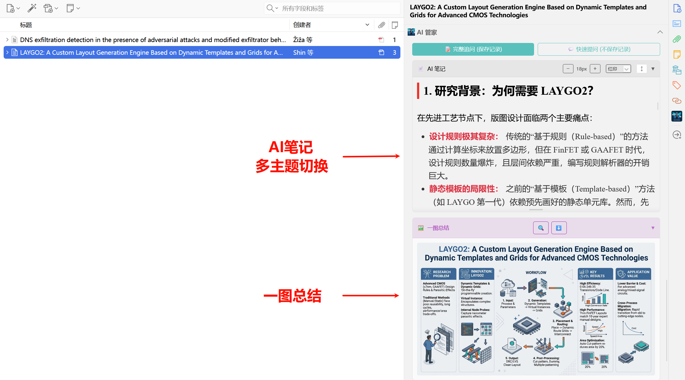

Google Gemini 3 Pro is recommended for paper summarization. Gemini explanations are often easy to understand.

> No free Google Gemini 3 Pro API? See [my gcli2api setup guide](https://github.com/steven-jianhao-li/zotero-AI-Butler/discussions/54#discussioncomment-15199692) and deploy [gcli2api](https://github.com/su-kaka/gcli2api) to obtain a personal Gemini 3 Pro access quota.

> **You focus on thinking; `Zotero-AI-Butler` clears the reading obstacles.**

## ✨ Feature Overview

### 1. Intelligent Note Generation and Review

AI Butler's core mission is to use LLMs such as Gemini or OpenAI to read papers deeply and automatically organize the summary into clear Markdown notes saved under the Zotero item.

- Automatic note saving: Generated notes are saved under the corresponding Zotero item and behave like native Zotero notes.
  - Reviewing notes: Click the note item to view it.
    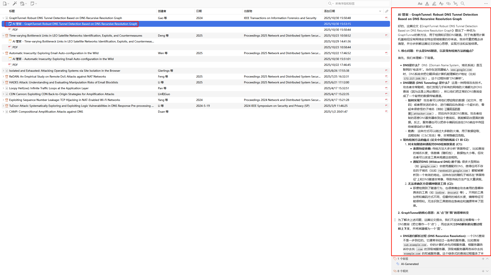
  - Side-by-side reading: Open the note while reading the original paper.
    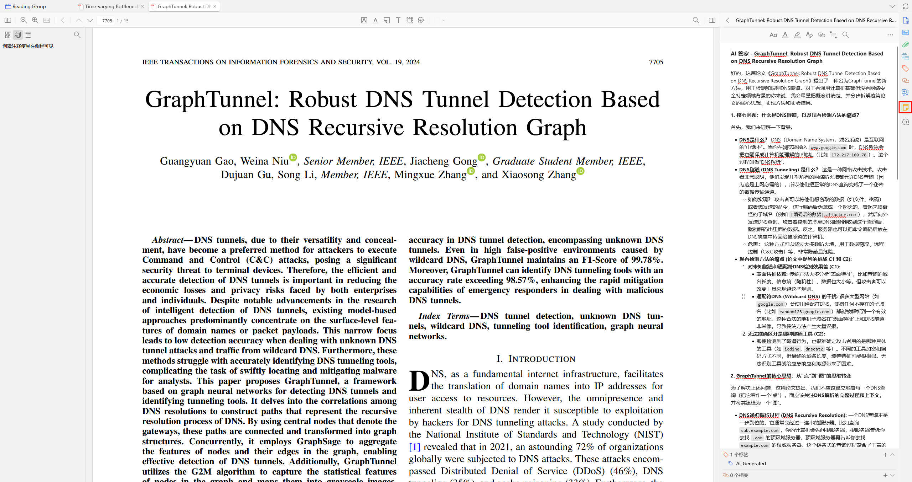

### 2. Three Flexible Ways to Trigger Tasks

AI Butler provides three ways to fetch and analyze your papers.

- Method 1: Right-click wake-up (instant processing)
  - Right-click a paper item and choose "Summon AI Butler for Analysis".
  - The task enters the queue immediately. Click **Details** to view the LLM response process in real time.

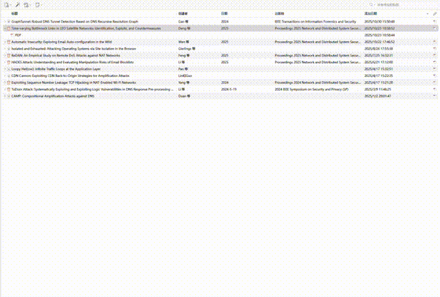

- **Multi-round re-reading**: If you want a more detailed re-analysis of a paper that already has a summary, or want to switch modes, choose **AI Butler Multi-round Re-reading** from the right-click menu, then choose **Multi-round Stitching** or **Multi-round Summary**. This overwrites the existing AI note.

- Method 2: Autopilot (automatic processing for new literature)
  - Disabled by default to minimize impact on Zotero performance.
  - Enable it in Dashboard -> UI Settings -> Auto-scan new literature.
  - After enabled, when you drag a new PDF into Zotero, the Butler waits for Zotero metadata retrieval to finish and then starts analysis automatically.
  - The setting is persisted after Zotero restarts.

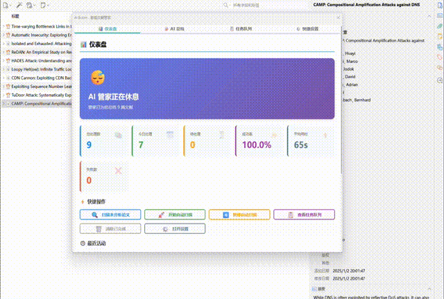

- Method 3: Batch processing (backfill old papers)
  - In the Dashboard, click "Scan Unanalyzed Papers". AI Butler finds papers without AI notes and lists them according to your Zotero collection structure.
  - Select papers freely, including collection-level selection, and click "Add to Queue".
  - AI Butler processes the backlog in the background at the speed you configured.

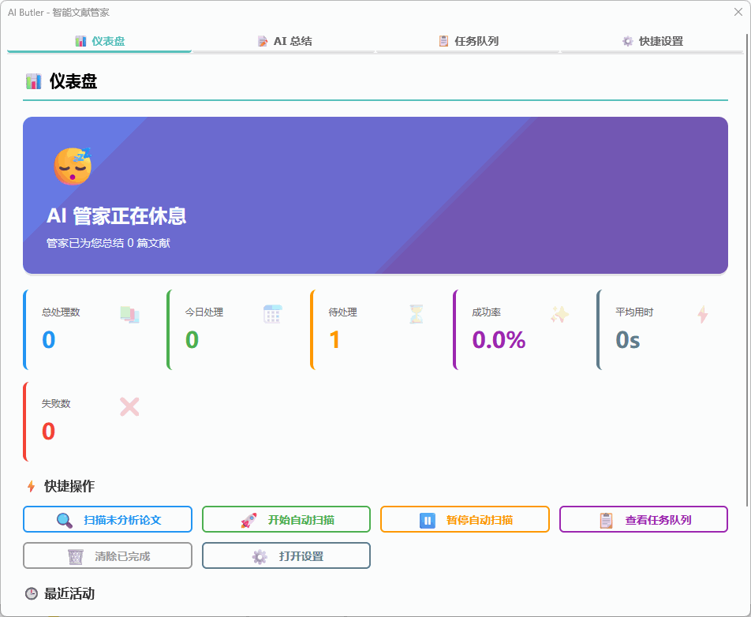

### 3. AI Butler Main Interface

AI Butler has a main page for managing tasks and configuration. Open it in either way:

a. Zotero top menu: Edit -> Settings -> AI Butler tab.
b. Right-click any item -> AI Butler Dashboard.

The dashboard mainly includes these pages:

- Dashboard: statistics and quick actions.

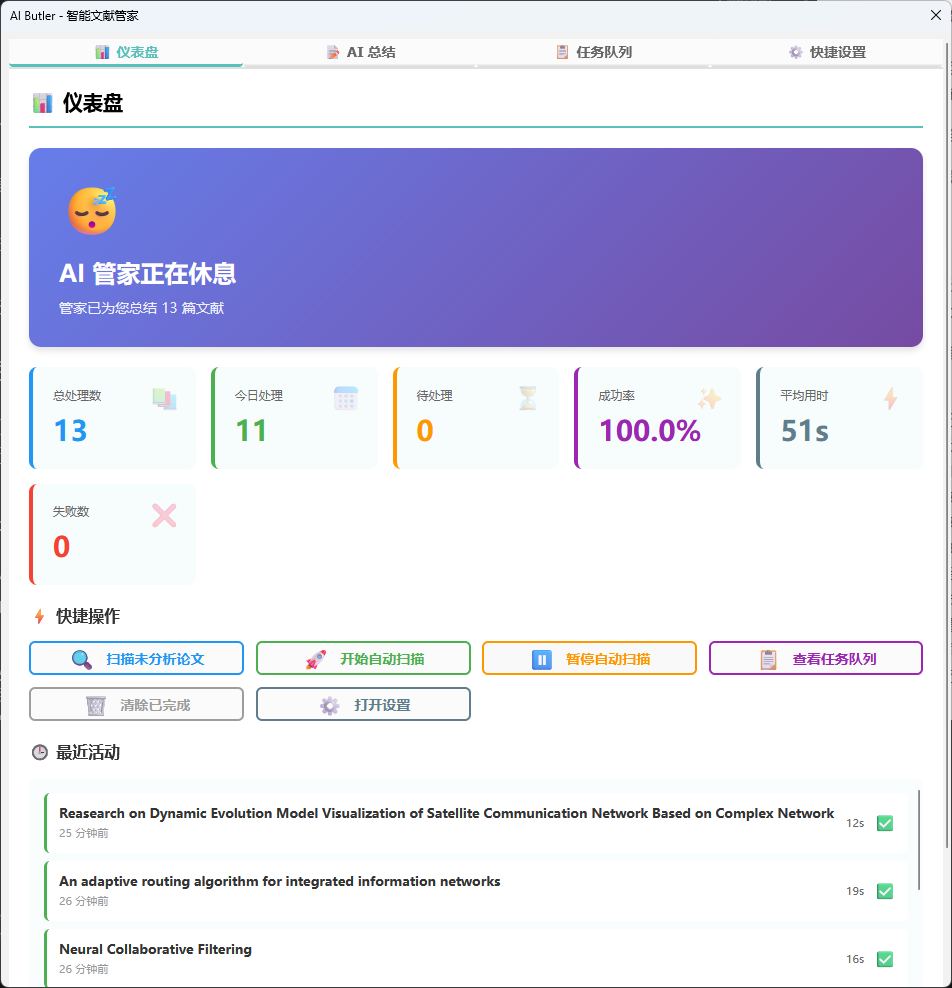

- Task Queue: manage and monitor all paper analysis tasks. Paper analysis follows a producer-consumer workflow. You can view pending, running, completed, or failed tasks here.

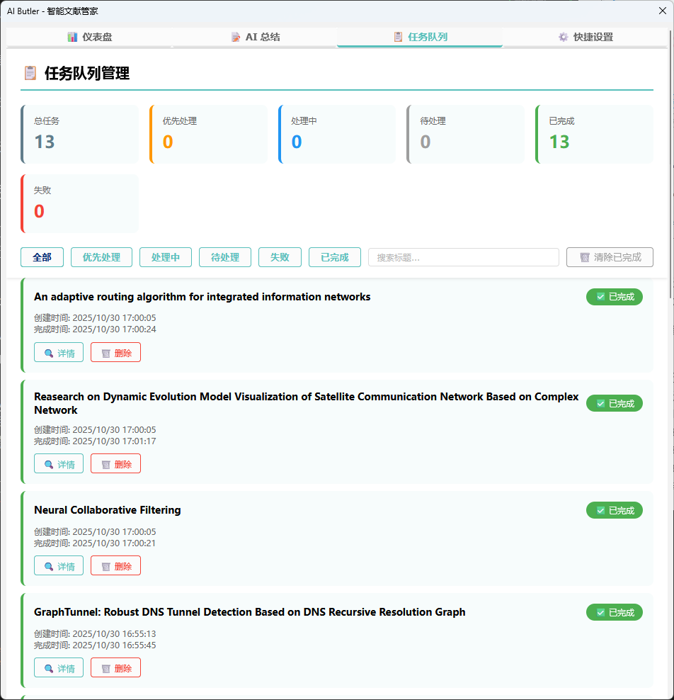

- Quick Settings: the configuration center.
  - API settings: currently supports OpenAI, Gemini, Anthropic, OpenAI-compatible services such as SiliconFlow, and other providers. After adding keys, click "Test Connection" to verify availability.
    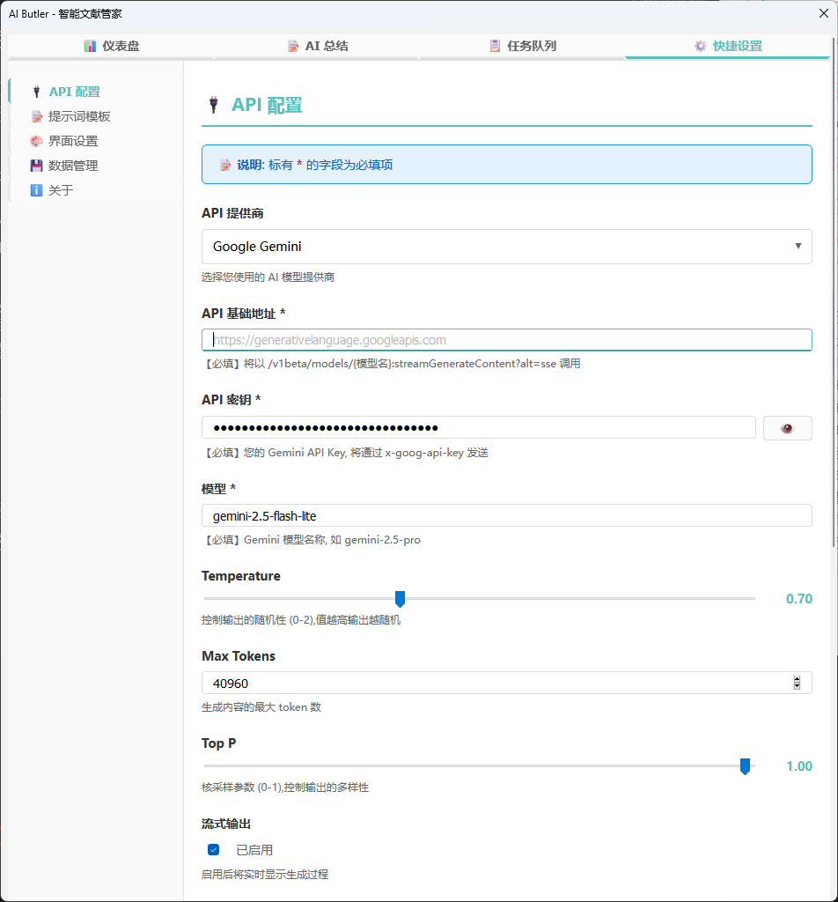
  - Processing speed: control how many papers are processed per minute to avoid API rate limits.
  - PDF processing mode: choose multimodal processing (Base64) or text extraction. Base64 is suitable for multimodal LLMs and lets the model directly "see" the PDF, improving understanding of figures, formulas, and tables. Text extraction is suitable for models without multimodal support.
    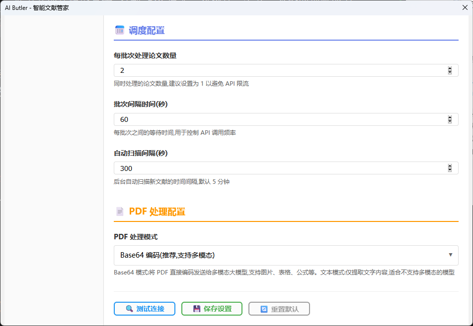
  - Prompt templates: built-in prompt templates with user customization.
    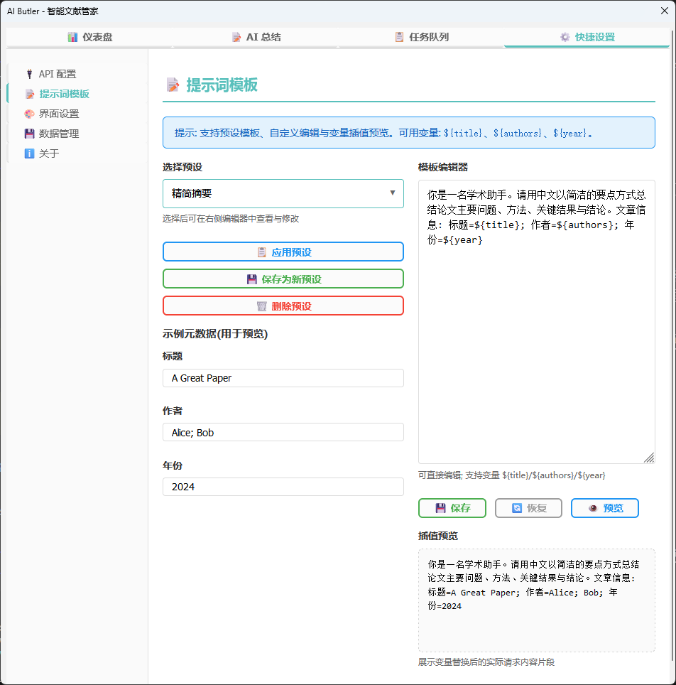

### 4. Chat and Follow-up Questions (Pre-release)

AI Butler supports multi-turn chat, allowing users to ask follow-up questions based on generated AI summaries.

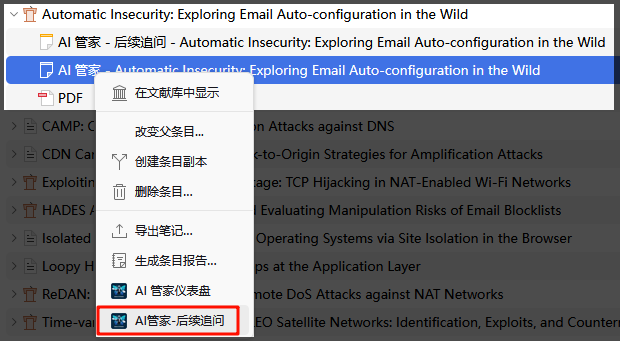
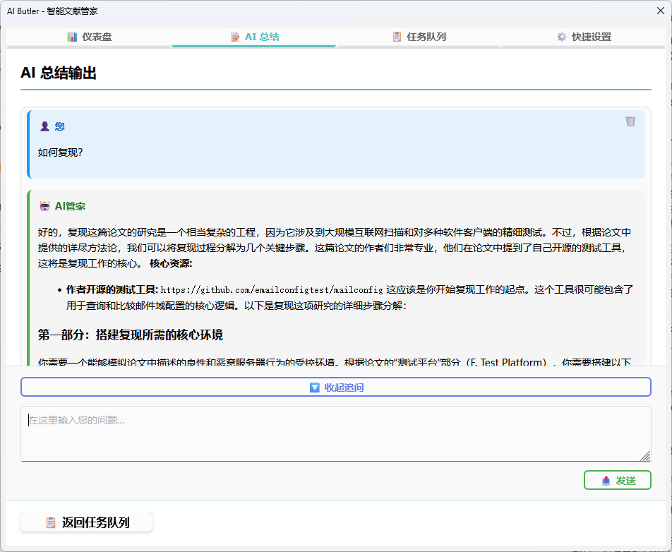

### 5. Multi-platform API Support

AI Butler supports multiple mainstream LLM platforms:

| Platform              | Recommended Model        | Notes                                                                                         |
| --------------------- | ------------------------ | --------------------------------------------------------------------------------------------- |
| **Google Gemini**     | gemini-3-pro-preview     | 🌟 Recommended. Strong multimodal capability and accurate PDF understanding                   |
| **OpenAI**            | gpt-5                    | Official new API                                                                              |
| **Anthropic Claude**  | claude-opus-4-5-20251101 | Strong overall capability                                                                     |
| **OpenAI Compatible** | Custom                   | Legacy OpenAI-style Chat Completions API, supporting third-party services such as SiliconFlow |
| **Volcano Ark**       | doubao-seed-1-8-251228   | 🆕 2 million free tokens per day, supports Doubao models                                      |
| **Ollama**            | llama3.2                 | Local or LAN model service; use text extraction or MinerU for PDF processing                  |

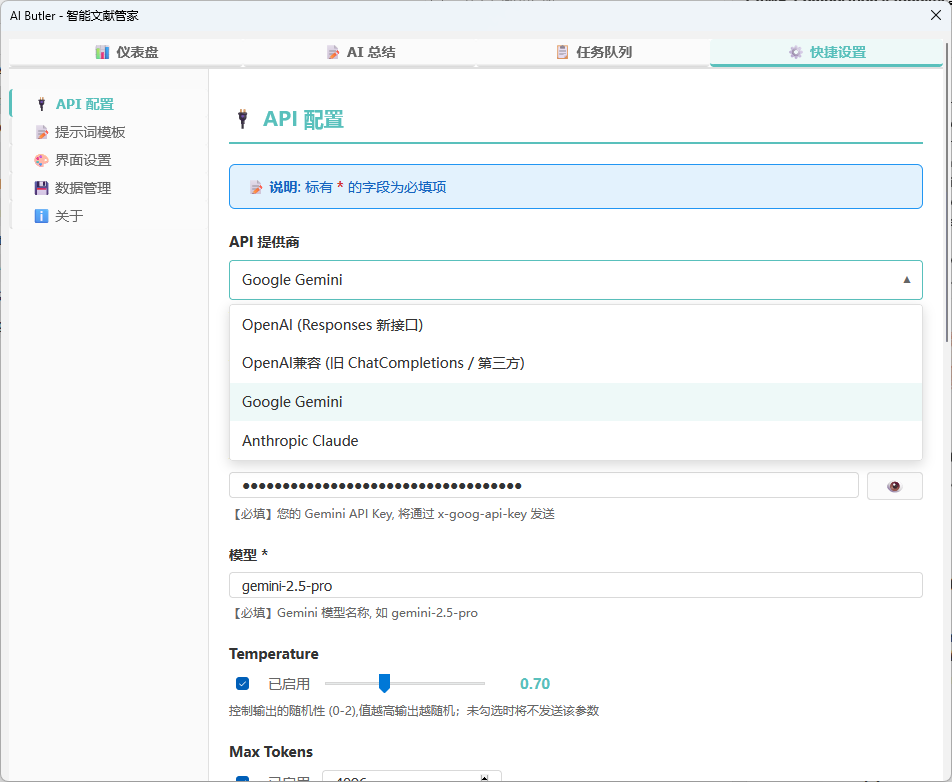

### 6. Prompt Preset Management

AI Butler provides powerful prompt management:

- **Built-in presets**: several common prompt templates with one-click switching.
- **Custom presets**: save and manage your own prompt templates.
- **Live preview**: preview variable replacement while editing, such as `{{title}}` and `{{authors}}`.
- **One-click restore**: restore system default prompts at any time.


#### Multi-round Chat and Summary Modes

AI Butler supports multi-round prompt configuration. Users can customize each round of prompts, such as research background and questions, methods and techniques, experiment design and results, and conclusions and outlook. The final output can combine multiple rounds into a complete summary.

| Mode                      | Description                                                       | Token Cost | Suitable For                        |
| ------------------------- | ----------------------------------------------------------------- | ---------- | ----------------------------------- |
| **Single turn**           | Generate a complete summary in one pass                           | Lowest     | Quick reading, limited time         |
| **Multi-round stitching** | Ask in-depth questions round by round and concatenate all answers | Higher     | Deep reading and detailed analysis  |
| **Multi-round summary**   | Summarize and refine after multi-round chat                       | Medium     | Balance between depth and concision |

- **Multi-round prompt configuration**: customize each round of prompts.
- **Final summary prompt**: configure the final aggregation prompt in multi-round summary mode.

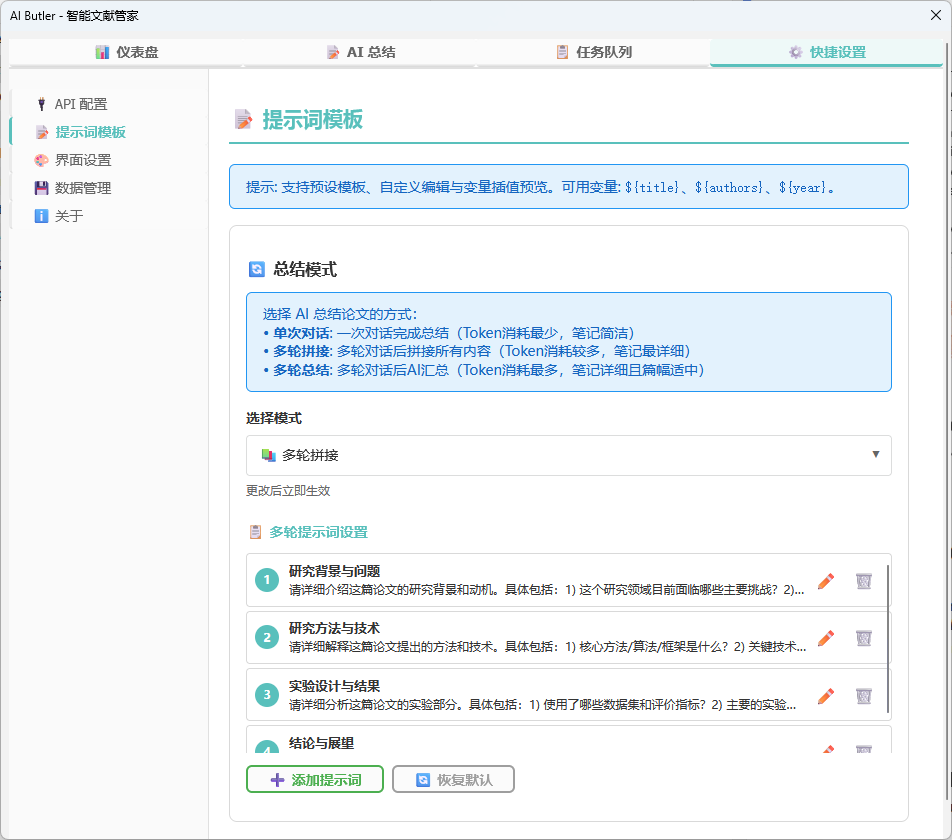

### 7. Theme Adaptation

AI Butler adapts to Zotero light and dark themes, keeping the interface comfortable in either mode.

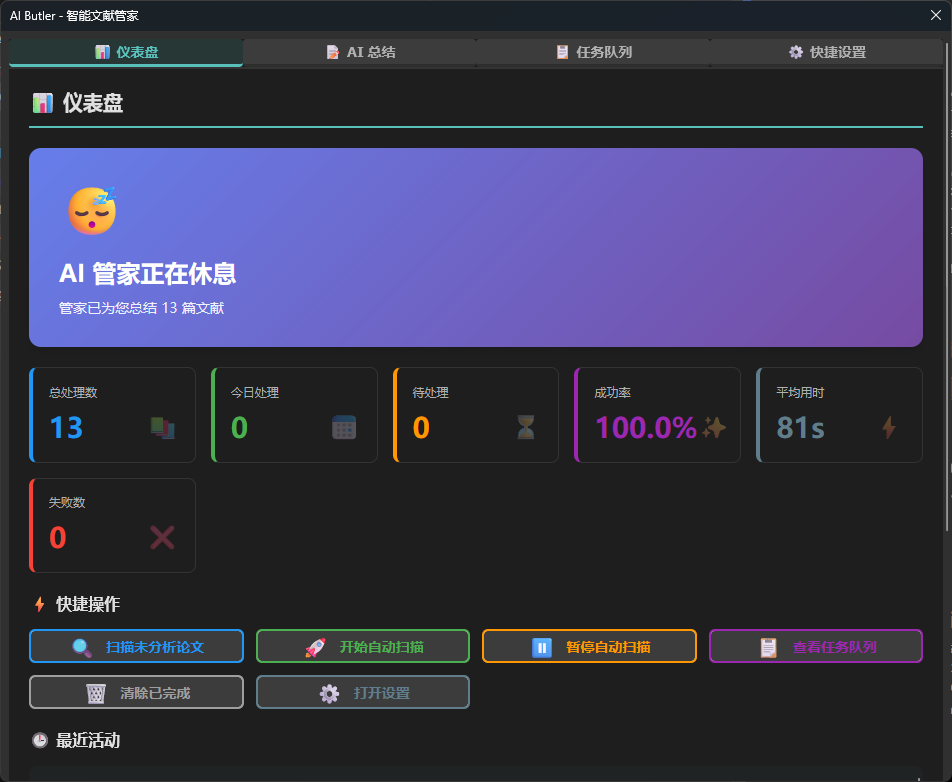

### 8. Sidebar AI Note Preview

In Zotero's right-side item information pane, AI Butler automatically displays AI notes for the current item for quick browsing.

- **Automatic detection**: finds and displays notes generated by AI Butler.
- **Styled rendering**: renders notes with polished CSS and supports multiple themes.
- **Collapse/expand**: click the title bar to collapse or expand the note area.
- **Resizable height**: drag the bottom handle to adjust height; settings are saved automatically.
- **Font scaling**: click the +/− buttons in the title bar to adjust font size.
- **Quick generation**: if there is no AI note, summon AI Butler with one click.

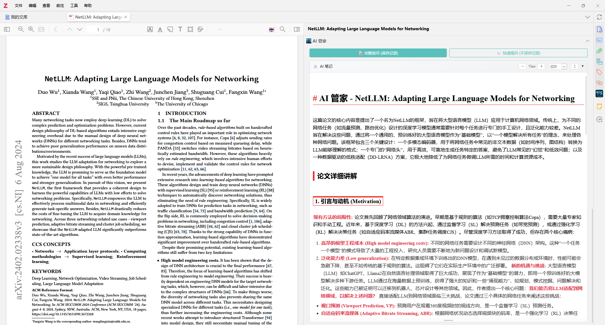

- **Sidebar follow-up questions**:
  - **Full follow-up (save history)**: open the chat window for deeper questions; the conversation is saved to the note.
  - **Quick question (do not save history)**: temporary questions without saving conversation history.

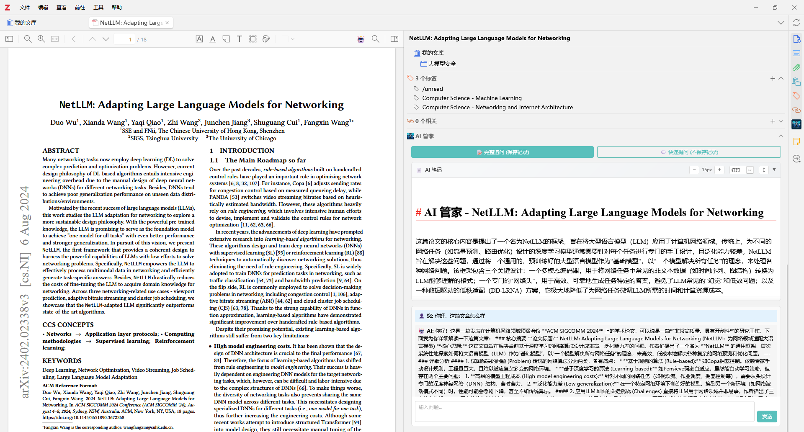

- **LaTeX rendering**: the sidebar supports KaTeX rendering for LaTeX math formulas.
  - **Automatic rendering**: recognizes and renders `$...$` inline formulas and `$$...$$` block formulas.
  - **Horizontal scrolling**: long formulas get a horizontal scrollbar to avoid overflow.
  - **Dark mode adaptation**: formula rendering works with Zotero light and dark themes.

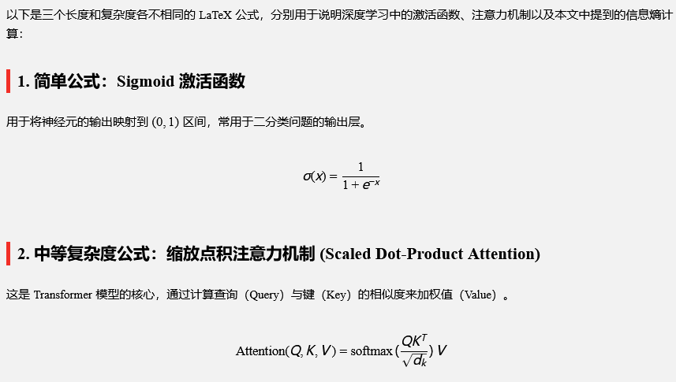

- **Pinned sidebar**: use Zotero's built-in pin feature to keep the AI Butler sidebar open while browsing papers.
  - **How to use**: right-click the AI Butler icon at the far right of the sidebar and click "Pin This Pane". Right-click again and click "Unpin This Pane" to unpin.

    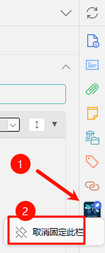

### 9. Note Style Themes

AI Butler supports custom rendering styles for sidebar notes.

- **Built-in themes**:
  - **GitHub** (default): clean GitHub-style rendering.
  - **Redstriking**: red theme suitable for highlighting important content.
- **Theme switching**: choose a note style in UI Settings.

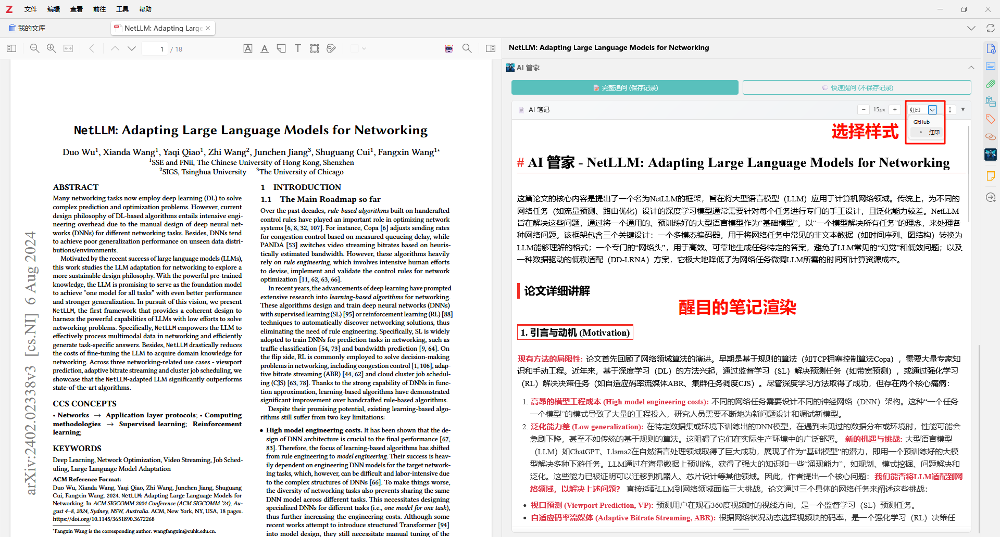

> 💡 Redstriking theme source: [Theigrams/My-Typora-Themes](https://github.com/Theigrams/My-Typora-Themes)

#### 🎨 Contribute a New Theme

More beautiful themes are welcome.

1. Create a new CSS file under `addon/content/markdown_themes/`, for example `your-theme-name.css`.
2. Use `#write` or `.markdown-body` as the selector prefix; the plugin adapts automatically.
3. Add the new theme to the `BUILTIN_THEMES` array in `src/modules/themeManager.ts`:

   ```typescript
   { id: "your-theme", name: "Your Theme Name", file: "your-theme-name.css" }
   ```

4. Add the option to the theme dropdown in `src/modules/views/settings/UiSettingsPage.ts`.
5. Add the new theme to `const themes = [` in `src/hooks.ts`.
6. Submit a Pull Request.

> Tip: Typora themes can be used directly. The plugin automatically adapts the `#write` selector.

### 10. One-Image Summary

- Right-click the parent paper item and choose "Summon AI Butler One-Image Summary" to try it. Configure the One-Image Summary key in Quick Settings first.
- 🎨 **Prompt improvements welcome**: your result may look better than the example. Share your prompts and results in [Discussions](https://github.com/steven-jianhao-li/zotero-AI-Butler/discussions); excellent prompts may become default templates.
- **Automatic One-Image Summary**: enable "Automatically add One-Image Summary" in the One-Image Summary settings page. After enabled, the system automatically generates a one-image summary whenever an AI paper summary is completed. This feature is disabled by default and requires secondary confirmation because it may consume significant API cost.


### 11. Multi-paper Literature Review Generation

AI Butler can analyze multiple papers under a collection and automatically generate a literature review report.

**How to use**:

1. Right-click any **collection** and choose **AI Butler Literature Review**.
2. Set the review name and custom prompt on the configuration page.
3. Select papers to include in the review; multiple PDFs are supported.
4. Click "Generate Review".

**Generated content**:

- Creates a new "Report" type item.
- Adds all selected PDFs as linked attachments to the report.
- Attachment naming format: `[first 30 characters of paper title] original attachment name`.
- Automatically generates a comprehensive literature review note.

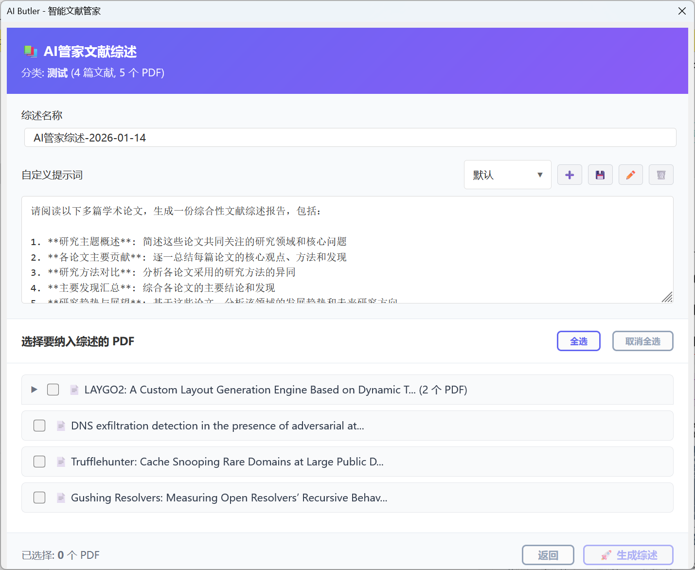

> 📖 For detailed instructions, see the [Literature Review documentation](https://steven-jianhao-li.github.io/zotero-AI-Butler/#/literature-review).

### 12. Mind Map

AI Butler can automatically generate paper mind maps, visualizing the structure of long papers and helping you quickly understand the paper's logic.

**Features**:

- **Automatic generation**: generates a structured mind map from AI analysis, covering core sections such as background, methods, key results, and conclusions.
- **Interactive operations**: zoom in, zoom out, fit to canvas, and freely explore the paper structure.
- **Adjustable height**: drag the bottom handle to adjust the mind map area's height; settings are saved automatically.
- **Export**:
  - **PNG export**: high-resolution 2x image, suitable for sharing and archiving.
  - **OPML export**: standard outline format importable into other mind-map tools such as XMind and Mubu.

**How to use**:

1. Right-click a paper item and choose **Summon AI Butler to Generate Mind Map**.
2. Wait for AI analysis to finish. The mind map appears automatically in the sidebar.
3. Use the toolbar buttons to zoom, export, and more.

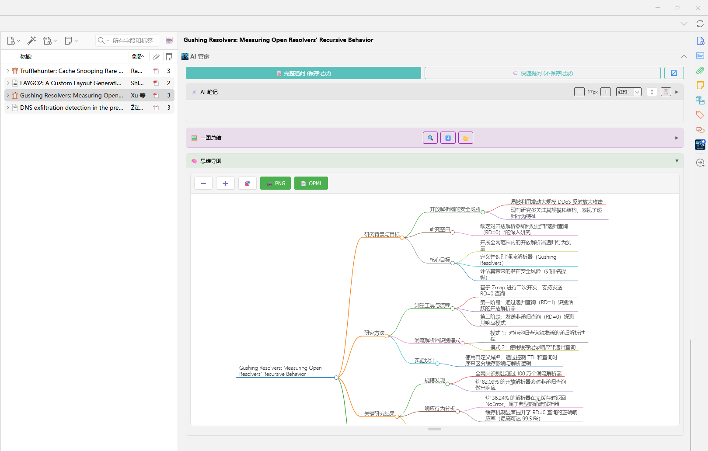

**Customization**:

In Quick Settings -> Mind Map, configure:

- **Prompt template**: customize the mind map structure beyond the default categories.
- **Export path**: set the default export directory; desktop by default.

## 🚀 Installation and Quick Start

### Install the Plugin

1. Visit the GitHub Releases page of this project.
2. Download the latest `.xpi` release file.
3. Open Zotero desktop and click Tools -> Plugins in the top menu.
4. Drag the downloaded `.xpi` file into the plugin window to install.

### Quick Setup and Use

1. Right-click any paper -> AI Butler Dashboard -> open the Settings tab.
2. Configure API: enter your API key (Gemini recommended) and click Test Connection.
3. Enable auto-scan: go to UI Settings and check Auto-scan new literature.

> Now, when you drag in a new PDF paper, AI Butler will generate close-reading notes in about one minute, depending on model speed.

### Contributors

Thanks to the following contributors for supporting and improving this project:

<a href="https://contrib.rocks/image?repo=steven-jianhao-li/zotero-AI-Butler">
  
</a>

## How to Cite

If this plugin helps your research, you are welcome to cite or acknowledge it in your paper. Your support keeps the project moving forward.

**BibTeX:**

```bibtex
@software{li_zotero_ai_butler,
  author    = {Li, Jianhao},
  title     = {{Zotero-AI-Butler: An AI-Powered Zotero Plugin for Automated Paper Reading and Summarization}},
  year      = {2026},
  publisher = {Zenodo},
  doi       = {10.5281/zenodo.20457937},
  url       = {https://doi.org/10.5281/zenodo.20457937}
}
```

## Acknowledgements

Thanks to these open-source projects:

- [Zotero Plugin Template](https://github.com/zotero/zotero-plugin-template)
- [zotero-ainote](https://github.com/BlueBlueKitty/zotero-ainote)

Special thanks to `BlueBlueKitty`, the author of `zotero-ainote`, whose project provided valuable code references. Because this project differs significantly from `zotero-ainote` in implementation, it was not forked directly; instead, it was rebuilt based on `Zotero Plugin Template`. If you are interested, please star `zotero-ainote` as well.

## ⭐ Star History

If this project helps you, please consider giving it a ⭐️.

[](https://star-history.com/#steven-jianhao-li/zotero-AI-Butler&Date)
