# Zotero插件：**zotero-AI-Butler【AI 管家】**

<!-- Badges -->
<p>
    <a href="https://github.com/steven-jianhao-li/zotero-AI-Butler/releases/latest"></a>
    <a href="https://github.com/steven-jianhao-li/zotero-AI-Butler/releases"></a>
    <a href="https://img.shields.io/badge/Using-Zotero%20Plugin%20Template-blue?style=flat-square&logo=github"></a>
    <a href="https://github.com/steven-jianhao-li/zotero-AI-Butler/stargazers"></a>
    <a href="https://github.com/steven-jianhao-li/zotero-AI-Butler/network/members"></a>
</p>
</div>

## [点我查看 **AI Butler Wiki**——配置与使用文档](https://steven-jianhao-li.github.io/zotero-AI-Butler/)

> **文献下载一时爽，打开阅读火葬场。**
> **天书难啃骨头硬，管家嚼碎再喂粮。**

想着稍后阅读的论文，最后却变成了永不阅读？
长篇大论的学术论文，有翻译却也抓不住重点？

你是否也被以下问题困扰？

- 痛点一：文章太多，读不过来。即便让AI辅助阅读，却还要一篇一篇的发给AI，效率低下。
- 痛点二：读完就忘，需要反复重新阅读。 辛辛苦苦读完一篇，两天后就忘了，想回忆又得从头看起，浪费时间。
- 痛点三：文章太长，即使有翻译插件，也难以抓住重点，读下一页忘上一页。

别慌！您的专属AI管家 `Zotero-AI-Butler` 已闪亮登场！

TA 是您7x24小时待命、不知疲倦且绝对忠诚的私人管家。
您只管像往常一样把文献丢进 Zotero，剩下的体力活全交给TA！
管家会自动帮您精读论文，将文章揉碎了总结为笔记，让您“十分钟完全了解”这篇论文！

## 🎖️ 核心功能

1.  **自动巡视 (自动扫描)**：管家会在后台默默巡视您的文献库，一旦发现您“丢”进来了新论文（或是您想对积压已久的旧论文开刀），只要还没有笔记，TA 就会自动开工。
2.  **深度解析 (生成笔记)**：管家的核心任务——利用大模型将论文精读、揉碎、嚼烂后，整理成一份热腾腾、条理清晰的 Markdown 笔记塞进您的 Zotero 条目下。
3.  **随时待命 (右键菜单)**：除了“全自动”托管，您也可以随时右键点击任何一篇论文，让管家现在、立刻、最高优先级地分析这篇文章。
4.  **管家智能（无损阅读）**：管家会根据自己模型的多模态能力直接处理PDF文件，不经过本地OCR或文本提取，最大程度保留论文内容的完整性和准确性，图片、表格、公式等都不在话下！

推荐使用 Google Gemini 3 pro 模型，Gemini读论文讲的很到位。
没有免费的 Google Gemini 3 pro API？参考[我的自用gcli2api配置教程](https://github.com/steven-jianhao-li/zotero-AI-Butler/discussions/54#discussioncomment-15199692)部署[gcli2api](https://github.com/su-kaka/gcli2api)获得几乎用不完的免费Gemini 3 pro访问额度！

> **您只负责思考，`Zotero-AI-Butler` 负责为您的阅读扫清障碍！**

## ✨ 功能介绍

### 1. 智能笔记生成与查阅

AI管家的核心使命是利用大模型（如 Gemini 或 OpenAI）深度阅读论文，并将总结内容自动整理为条理清晰的 Markdown 笔记，保存至 Zotero 条目下。

- 笔记自动保存： 生成的笔记会自动保存到 Zotero 对应的条目下，笔记交互逻辑与 Zotero 原生笔记一致。
  - 笔记查阅： 点击笔记条目进行查看。
    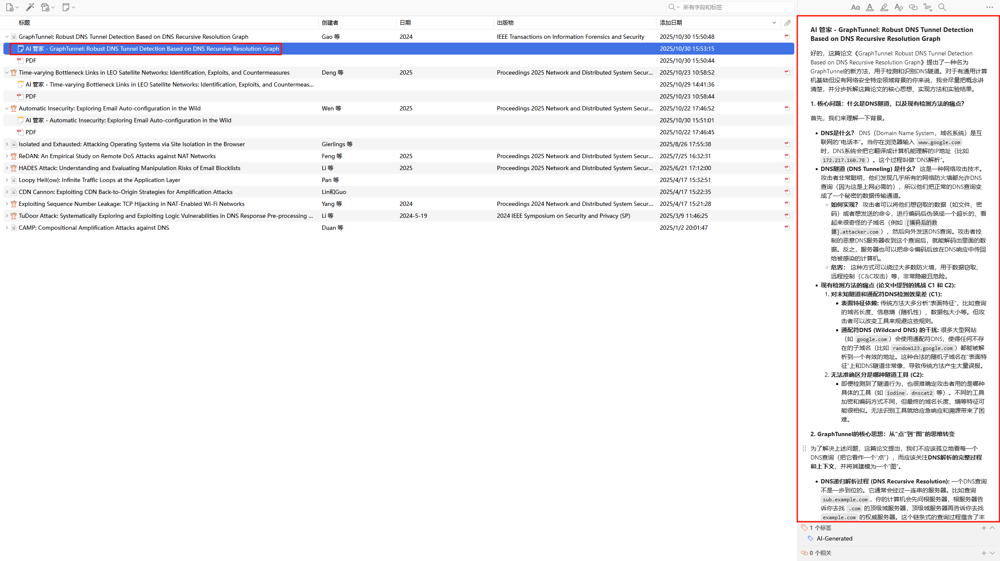
  - 对照阅读： 在阅读论文原文时，可以同时打开笔记，与原文一同阅读。
    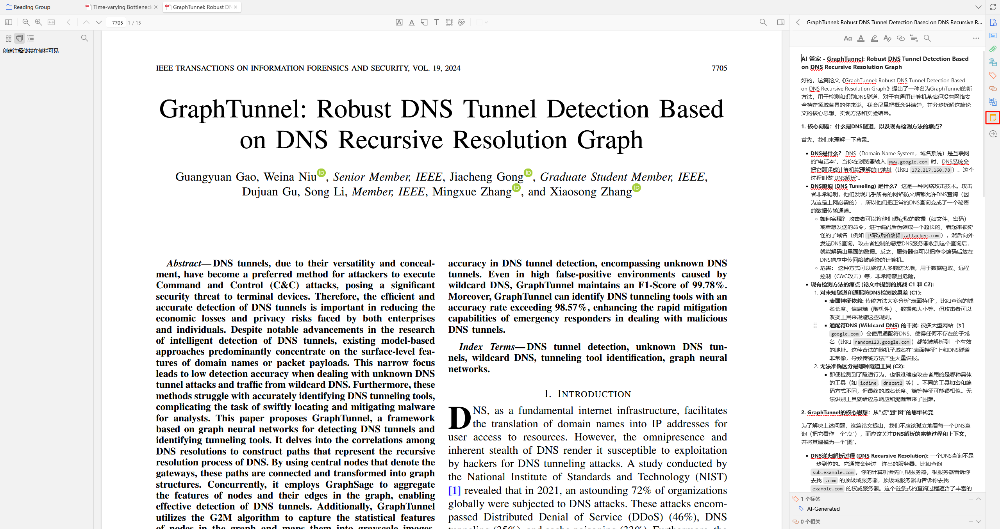

### 2. 灵活的三种任务触发方式

AI管家提供三种方式来获取和分析您的论文。

- 方式一：右键唤醒 (即时处理)
  这是最直接的交互方式。当您需要立即分析某篇特定论文时：
  - 在论文条目上右键，选择 “召唤AI管家进行分析”。
  - 任务将立即进入队列。您可以点击**“详情”**，实时查看大模型的分析响应过程。

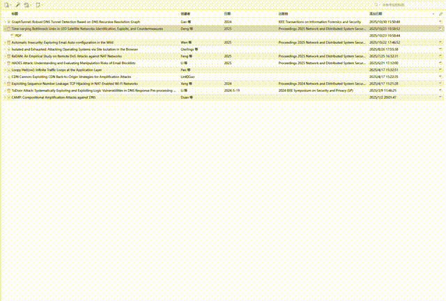

- 方式二：自动巡航 (新文献自动处理)
  实现“一劳永逸”的自动化工作流。
  - 默认关闭： 为最小化对 Zotero 性能的影响，此功能默认关闭。
  - 一键开启： 您可以在 “仪表盘” -> “界面设置” 中开启 “自动扫描新文献” 功能。
  - 自动运行： 开启后，当您将新论文（如PDF）拖入 Zotero，管家会等待 Zotero 完成元数据检索，然后自动开始分析。
  - 持久化设置： 该设置会自动保存，Zotero 重启后依然生效。

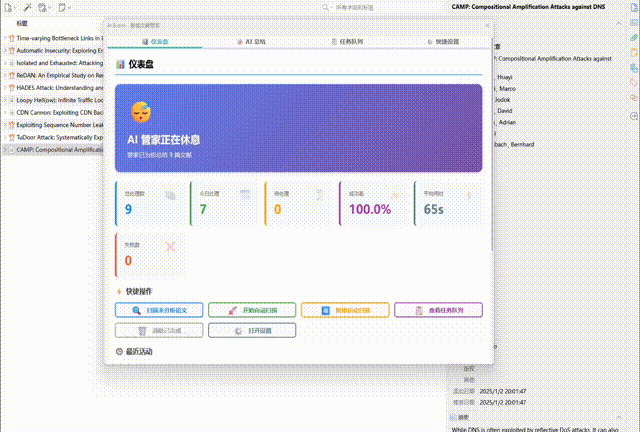

- 方式三：批量处理 (旧文献回溯补充)
  适用于补充总结您文献库中积压已久的旧论文。
  - 未总结论文扫描： 在 “仪表盘” 中，点击 “扫描未分析论文”。AI管家会自动找出所有没有AI管家笔记的论文，并按您的 Zotero 目录结构清晰排列。
  - 批量选择添加：您可以自由勾选需要补充笔记的论文（可按目录全选），点击 “添加到队列”。
  - 后台处理：AI管家会在后台按照您设置的速度，慢慢处理这些积压的论文。

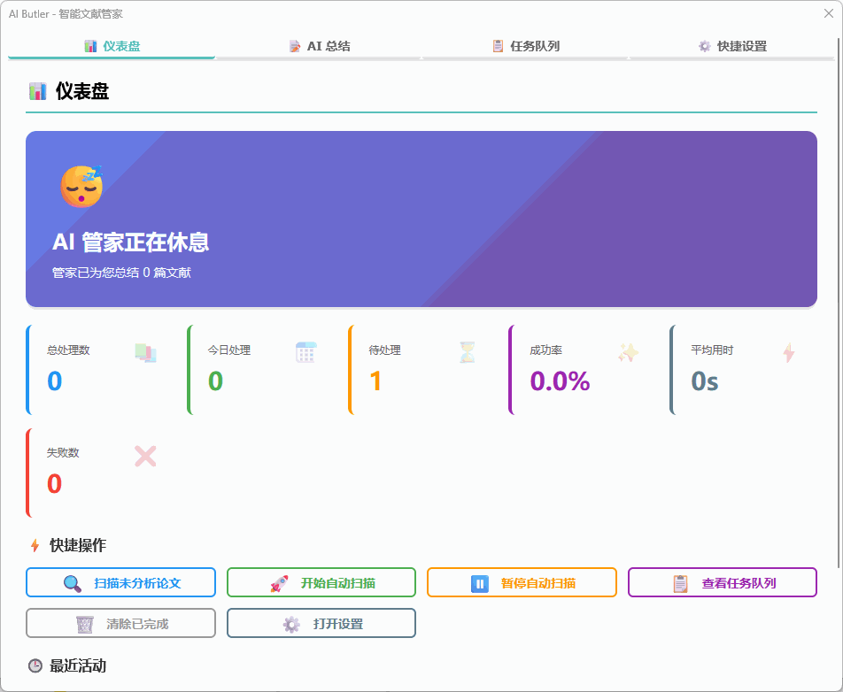

### 3. AI管家主界面

AI管家拥有主页面，是管理所有任务和配置的核心界面。可以通过以下两种方式打开：
a. Zotero 顶部菜单：“编辑” -> “设置” -> “AI管家” 选项卡。
b. 任意条目上右键 -> “AI管家仪表盘”。

仪表盘主要包含四大页面：- 仪表盘：提供统计信息和快捷操作。

- 仪表盘：提供统计信息和快捷操作。

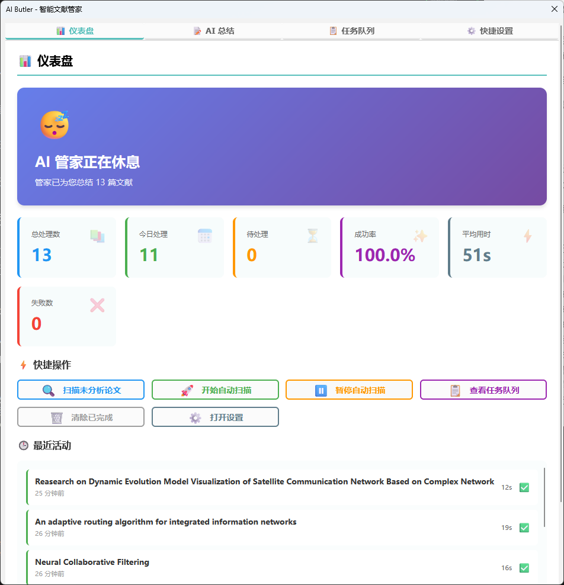

- 任务队列：管理和监控所有论文分析任务。所有论文分析都基于“生产者-消费者”模式进行。可以在此页面查看所有待处理、进行中、已完成或失败的论文任务状态。

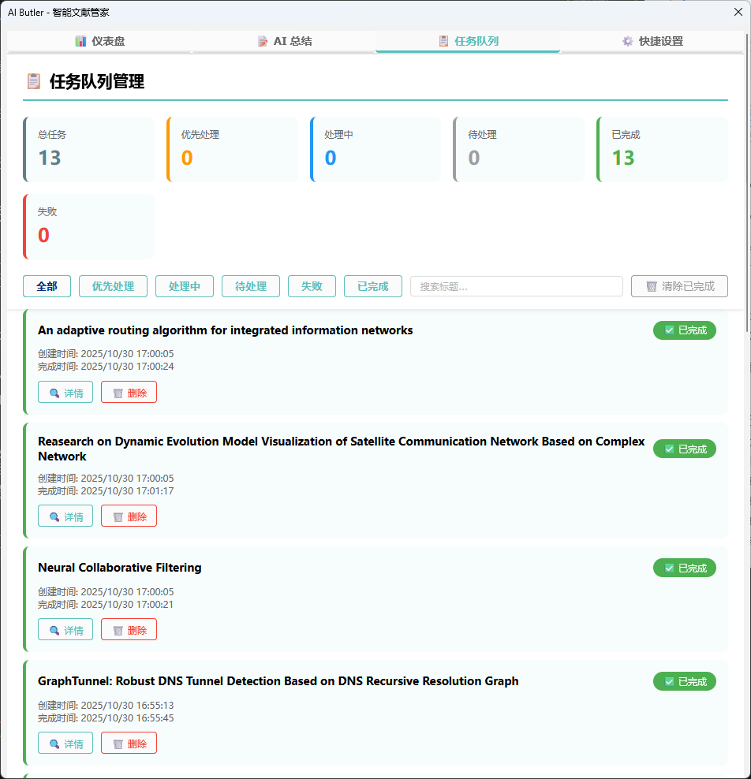

- 快捷设置：这是插件的配置中心，支持配置：
  - API配置： 目前支持 OpenAI、Gemini、Anthropic 以及 OpenAI兼容（支持第三方如硅基流动等）四大平台。配置密钥后可点击 “测试连接” 验证可用性。
    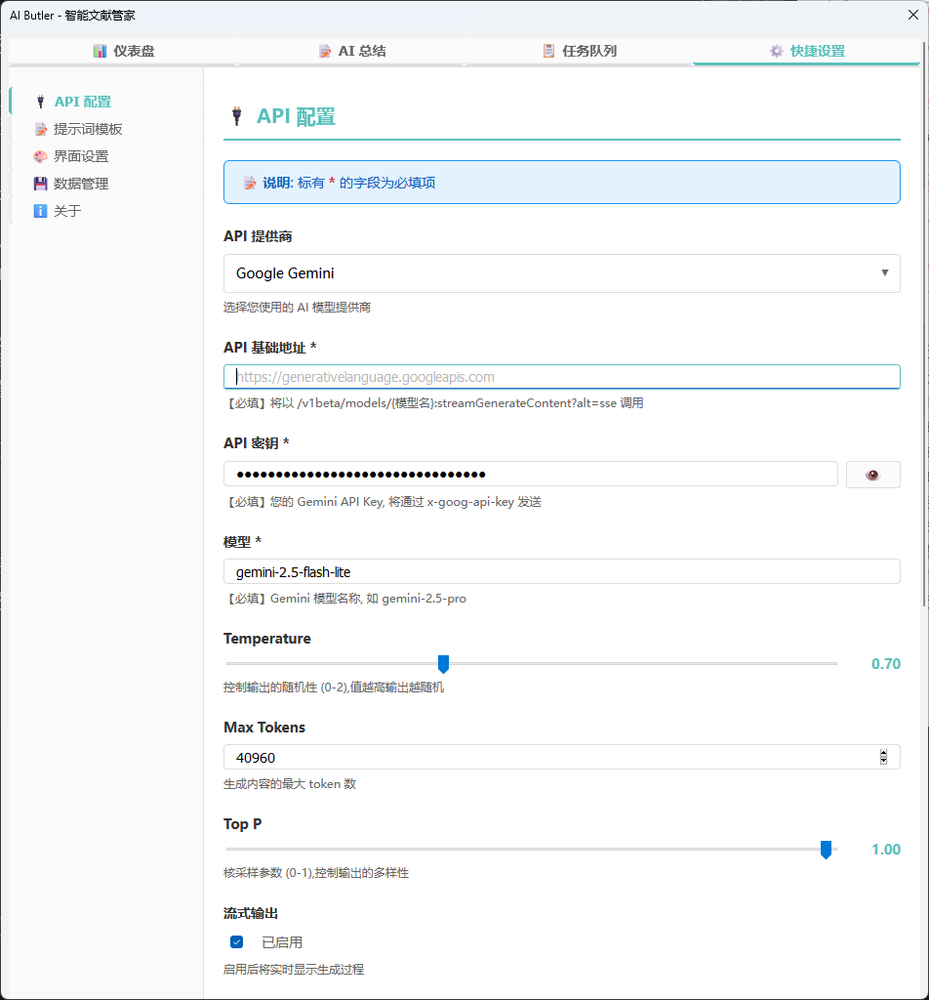
  - 任务处理速度： 控制每分钟处理论文的数量，避免API调用超限。
  - PDF处理方式： 可选择多模态处理（Base64编码）或文字提取模式。Base64编码适用于多模态大模型（如Gemini 2.5 Pro），此方式能让模型直接“看到”PDF原文，对图片、公式、表格的理解能力更强；文字提取模式适用于不支持多模态的模型。
    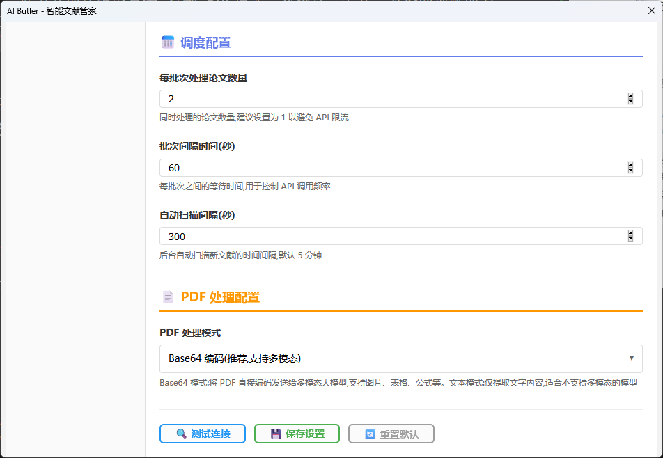

  - 提示词模板： 内置多种提示词模板，并支持用户自定义。
    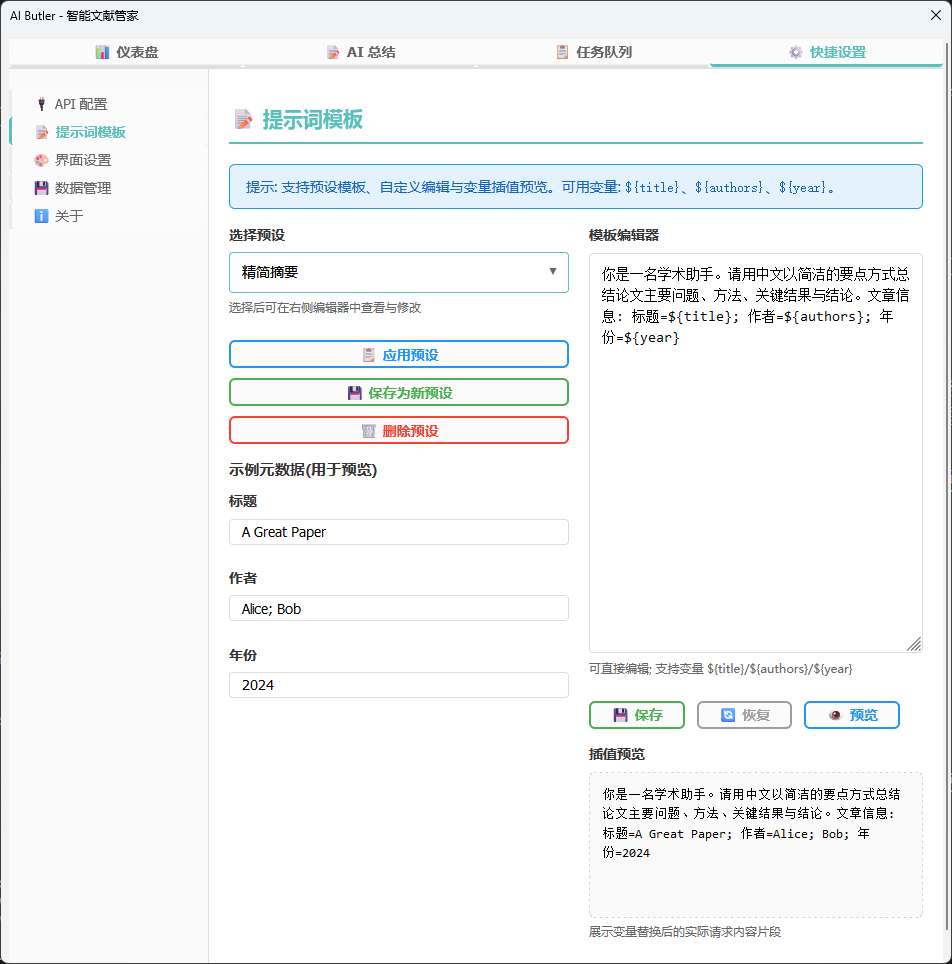

### 4. 对话与追问(Pre-release功能)

AI管家支持多轮对话功能，允许用户在生成的AI总结基础上进行后续追问。
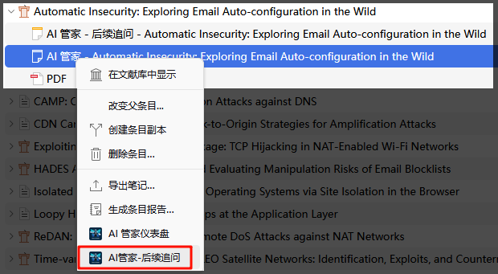
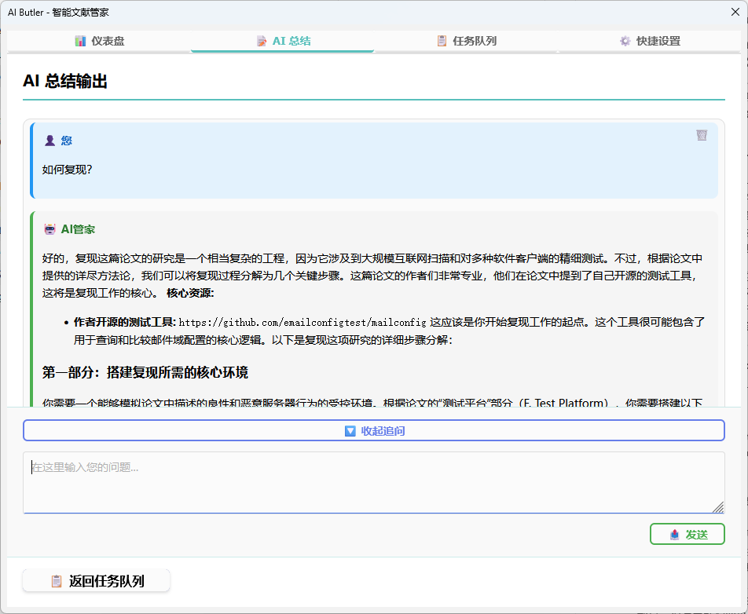

### 5. 多平台API支持

AI管家支持多种主流大模型平台，满足不同用户的需求：

| 平台                 | 推荐模型                 | 特点                                                                                |
| -------------------- | ------------------------ | ----------------------------------------------------------------------------------- |
| **Google Gemini**    | gemini-3-pro-preview     | 🌟 推荐！多模态能力强，PDF理解准确                                                  |
| **OpenAI**           | gpt-5                    | 官方新接口                                                                          |
| **Anthropic Claude** | claude-opus-4-5-20251101 | 综合能力优秀                                                                        |
| **OpenAI 兼容**      | 自定义                   | OpenAI旧接口，使用标准的 Chat Completions 接口格式，支持 SiliconFlow 等第三方服务商 |

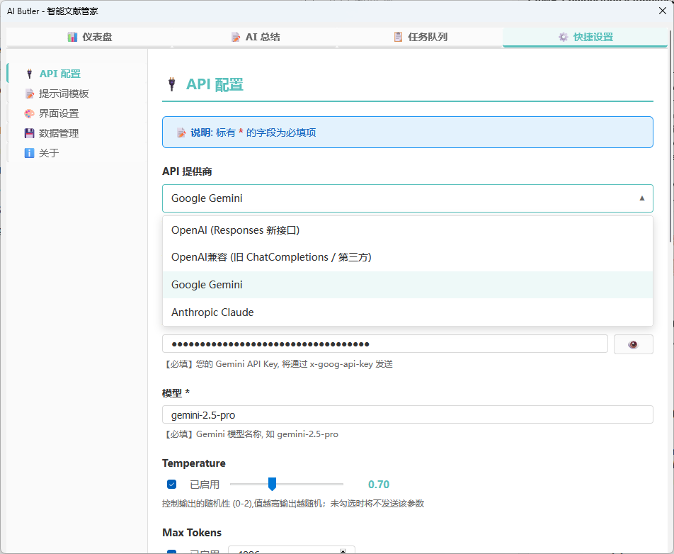

### 6. 提示词预设管理

AI管家提供强大的提示词管理功能：

- **内置预设**：提供多种常用提示词模板，一键切换。
- **自定义预设**：支持保存和管理用户自定义的提示词模板。
- **实时预览**：编辑提示词时可实时预览变量替换效果（如 `{{title}}`、`{{authors}}` 等）。
- **一键恢复**：可随时恢复为系统默认提示词。


#### 多轮对话与总结模式

AI管家新功能——支持多轮提示词配置，用户可以自定义每轮对话的提示词，包括：研究背景与问题、研究方法与技术、实验设计与结果、结论与展望等，最终汇总多轮对话至一篇完整总结。

| 模式         | 说明                       | Token消耗 | 适用场景               |
| ------------ | -------------------------- | --------- | ---------------------- |
| **单次对话** | 一次性生成完整总结         | 最少      | 快速阅读、时间紧迫     |
| **多轮拼接** | 分轮深入提问，拼接所有回答 | 较多      | 深度研读、需要详细分析 |
| **多轮总结** | 多轮对话后AI汇总精炼       | 中等      | 平衡深度与简洁         |

- **多轮提示词配置**：用户可以自定义每轮对话的提示词，包括：研究背景与问题、研究方法与技术、实验设计与结果、结论与展望等。
- **最终总结提示词**：在多轮总结模式下，可配置AI最终汇总时使用的提示词。

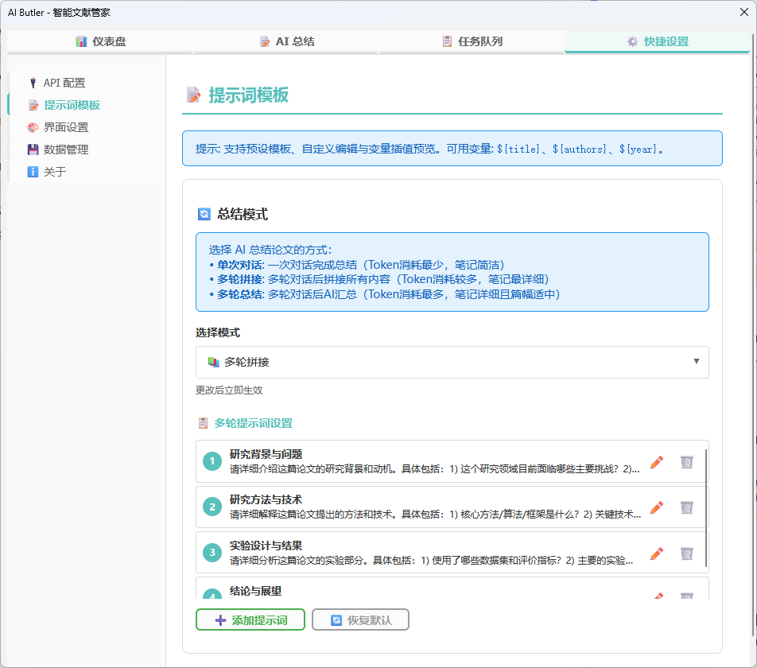

### 7. 主题适配

AI管家完美适配 Zotero 的明暗主题切换，无论您使用亮色还是暗色模式，界面都能自动适配，保护您的眼睛。

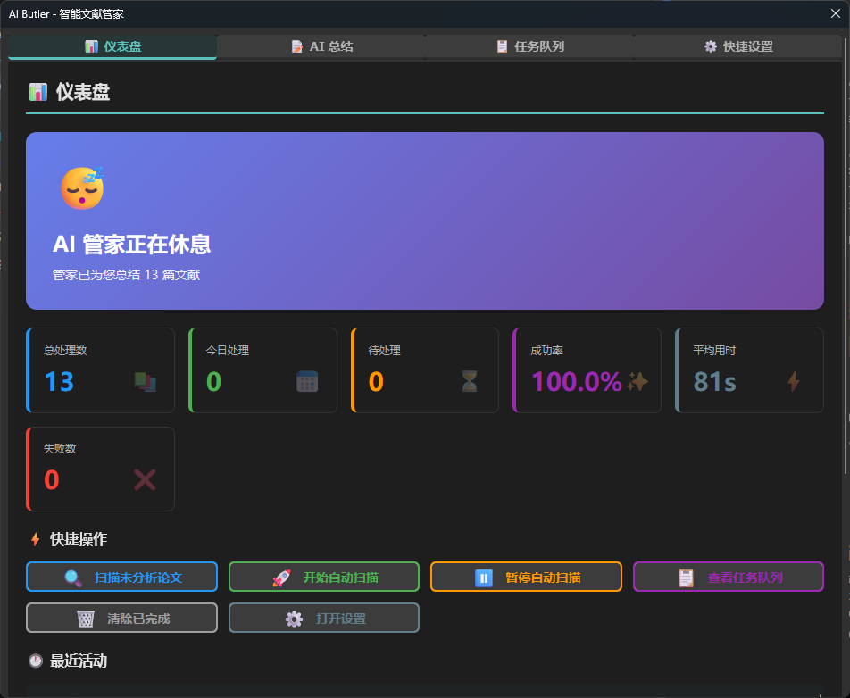

### 8. 侧边栏 AI 笔记预览

在 Zotero 右侧的条目信息面板中，AI 管家会自动展示该文献的 AI 笔记内容，方便您快速浏览。

- **自动检测**：自动查找并显示 AI 管家生成的笔记
- **样式渲染**：使用精美的 CSS 样式渲染笔记内容，支持多种主题切换
- **折叠/展开**：点击标题栏可折叠或展开笔记区域
- **高度可调**：拖拽底部手柄调整笔记区域高度，设置自动保存
- **字体缩放**：点击标题栏的 +/− 按钮调整字体大小
- **快速生成**：如果没有 AI 笔记，可一键召唤 AI 管家生成

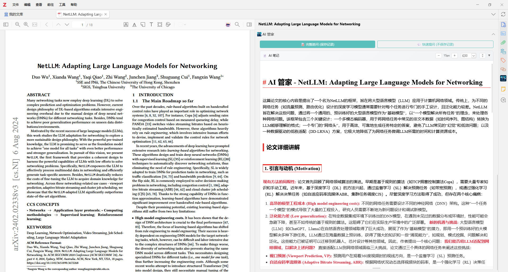

- **侧边栏追问**：
  - **完整追问 (保存记录)**：打开对话窗口进行深度追问，对话记录自动保存到笔记
  - **快速提问 (不保存记录)**：临时提问，不保存对话历史

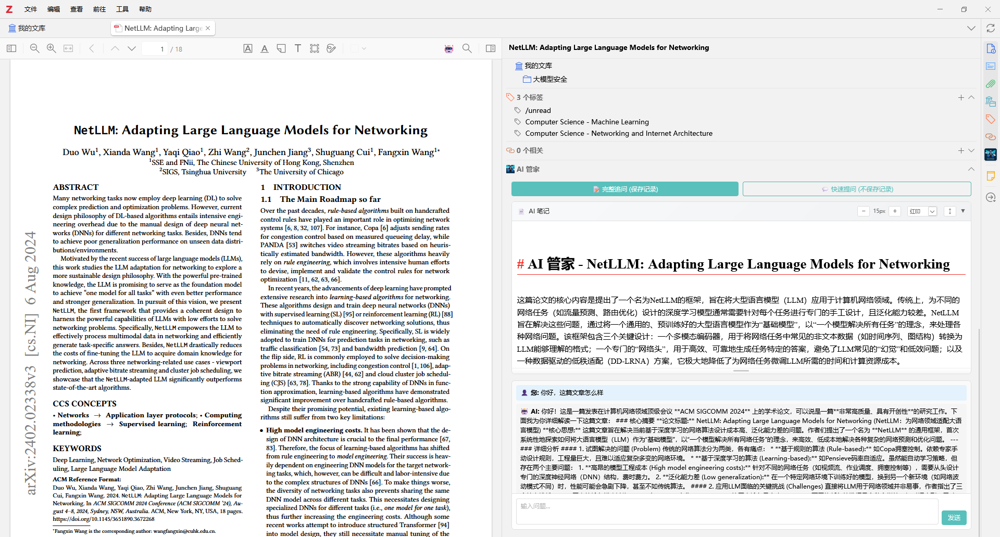

### 9. 笔记样式主题

AI 管家支持自定义侧边栏笔记的渲染样式。

- **内置主题**：
  - **GitHub** (默认) - 简洁清爽的 GitHub 风格
  - **红印 (Redstriking)** - 红色主题，适合强调重点内容
- **主题切换**：在 "界面设置" 中可选择笔记样式

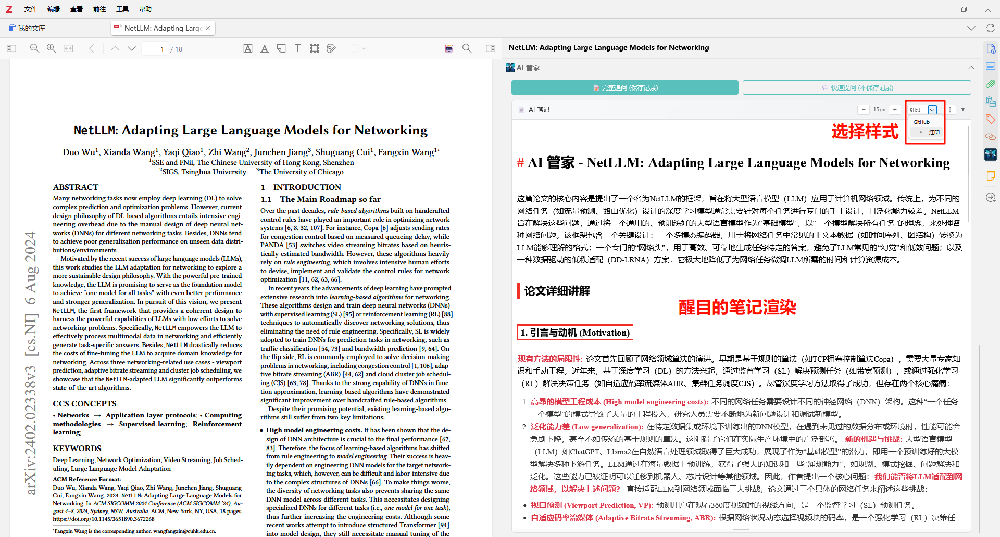

> 💡 红印主题来源：[Theigrams/My-Typora-Themes](https://github.com/Theigrams/My-Typora-Themes)

#### 🎨 贡献新主题

欢迎为 AI 管家贡献更多漂亮的主题！

1. 在 `addon/content/markdown_themes/` 目录下创建新的 CSS 文件（如 `your-theme-name.css`）
2. CSS 中可使用 `#write` 或 `.markdown-body` 作为选择器前缀（会自动适配）
3. 在 `src/modules/themeManager.ts` 的 `BUILTIN_THEMES` 数组中添加新主题：
   ```typescript
   { id: "your-theme", name: "您的主题名称", file: "your-theme-name.css" }
   ```
4. 在 `src/modules/views/settings/UiSettingsPage.ts` 的主题下拉列表中添加选项
5. 在 `src/hooks.ts` 的 `const themes = [` 中添加新主题
6. 提交 Pull Request！

> 提示：Typora 主题可以直接使用！插件会自动适配 `#write` 选择器。

### 10. Zotero笔记字体大小调整

笔记字体大小可通过 Zotero 原生设置进行调整：
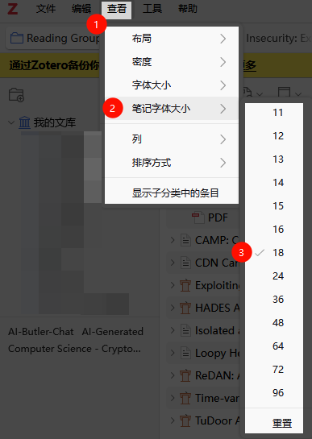

## 🚀 安装与快速上手

### 安装插件

1. 访问本项目的 GitHub Releases 页面。
2. 下载最新的Release版本的 `.xpi` 文件。
3. 打开 Zotero 桌面端，点击顶部菜单的 “工具” -> “插件”。
4. 将下载好的 .xpi 文件拖拽到插件窗口中，完成安装。

### 快速配置与使用

1. 在任意论文上右键 -> “AI管家仪表盘” -> 打开 “设置” 选项卡。
2. 配置API： 填入您的 API 密钥（推荐Gemini），点击 “测试连接” 确保网络通畅。
3. 开启自动扫描： 转到 “界面设置” 选项卡，勾选 “自动扫描新文献”。

> 现在，当您拖入新的PDF论文时，AI管家将在1分钟左右（取决于模型速度）自动为您生成精读笔记。

### 贡献者

感谢以下贡献者对本项目的支持与帮助：

<a href="https://contrib.rocks/image?repo=steven-jianhao-li/zotero-AI-Butler">
  
</a>

## 致谢

感谢下面的开源项目：

- [Zotero Plugin Template](https://github.com/zotero/zotero-plugin-template)
- [zotero-ainote](https://github.com/BlueBlueKitty/zotero-ainote)

尤其感谢 `zotero-ainote` 项目的作者 `BlueBlueKitty`，其项目为本插件提供了宝贵的代码参考。由于本项目在实现上与 `zotero-ainote` 存在较大差异，因此未直接fork该项目，而是基于 `Zotero Plugin Template` 重新开发。大家有兴趣可以给 `zotero-ainote` 点个star以示支持！

## ⭐ Star History

如果你觉得这个项目对你有帮助，请不要吝啬你的 ⭐️！

[](https://star-history.com/#steven-jianhao-li/zotero-AI-Butler&Date)
