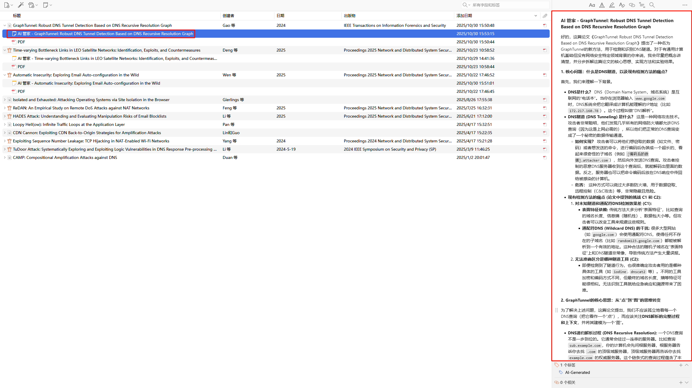

我们来开发一个新的大功能。一句话总结就是把文献的基础内容可以用一张类似PPT的图说清楚（使用nano-banana pro的API），保存到Zotero笔记里面（一个单独的笔记，以AI 管家一图总结 - 开头。）
为了做这个功能，我们需要在AI管家的主界面的快捷设置中，新注册一个新的设置页面，叫做“一图总结”。里面需要让用户配置nano-banana pro的API和Base URL（参考API配置页面的实现），同时让用户配置生图的工作流。默认的工作流是，先用文本大模型（直接用用户在API配置中设置的API）把PDF论文进行总结（默认提示词见最后），记为${summaryForImage}$（这里给个选项，允许用之前总结的AI管家笔记作为代替，可以省一点费用，默认关闭就好）。之后调用生图大模型，使用下面这个提示词，让大模型生成图片。${title}$已经有函数来实现了（提示词模板页面）。${language}$应该在“一图总结”设置项中让用户配置，默认是中文（让用户填空）。所有提示词，都提供框让用户进行修改，可以参考现有页面中的“提示词配置”。不要重复造轮子，很多样式都在src\modules\views\ui\components.ts里面定义好了，可以直接用。
同时，咱们生图现在只提供一个让用户右键论文条目的操作菜单，叫做“召唤AI管家一图总结”。点击后，咱们这个生图也要加入任务队列，方便用户查看生图的进度。可以以工作流的形式展示当前进度。
例如示例的工作流就是：

【视觉形象提取】（外面有个转圈提示持续时间，如果完成则为完成的圈，提示用时多少）->【一图总结】（外面转圈...）

如果出现报错（指的是用户态报错，例如用户API不可用这样的），要像“API配置”页面中的测试链接中的报错一样，展示非常详细的报错，便于我处理他们提出来的问题。

在实现时，建议自底向上去实现。例如先实现把图片放到笔记里面的功能。由于生图API浪费不起，你写好后，可以把本地的一张图贴到笔记里面。（我可以帮助你进行操作，相当于你写好这个图的路径，我右键论文点击一图总结，你就把这个图写到笔记里面，先不经过大模型）。当然写的时候由于是自底向上，所以封装性一定要好，不给之后埋隐患。

最后，等一切都完成了，把这个功能更新到Readme里面。

```总结提示词
请阅读我提供的论文内容，提取用于生成“学术概念海报”的关键视觉信息。

请确保描述具体、形象，适合画面呈现。
请输出如下内容（只输出内容，不要废话）：
Visual_Summary:
1. **Core_Metaphor** (核心隐喻): [用一个具体的物体或场景来比喻这篇论文的核心，例如：一座连接两端的桥梁、一个多层金字塔、一个过滤漏斗等]
2. **Key_Objects** (关键物体): [列出画面中必须出现的3-4个具体元素，如：服务器图标、大脑切片图、DNA螺旋、代码片段]
3. **Process_Flow** (流程动作): [描述元素之间的动态关系，如：数据流从左向右汇聚、层级自下而上构建、两个模块相互循环]
4. **Highlights** (高亮重点): [论文最大的创新点，需要用高亮颜色或放大显示的简短关键词，不超过5个字]
5. **Short_Title** (精简标题): [适合放在图片正中央的超短标题，不超过10个字符]
---
论文内容如下：
${context}
```

```生图提示词
根据“${summaryForImage}$”，生成一张学术论文概念图，清晰展示以下内容：

研究问题：中提到的核心问题
创新方法：论文提出的主要方法或技术
工作流程：从输入到输出的处理流程
关键结果：主要实验发现或性能提升
应用价值：该研究的实际意义
论文标题：${title}$
要求：
**设计要求 (Design Guidelines - STRICTLY FOLLOW):**
1.  **艺术风格 (Style):**
    *   Modern Minimalist Tech Infographic (现代极简科技信息图).
    *   Flat vector illustration with subtle isometric elements (带有微妙等距元素的扁平矢量插画).
    *   High-quality corporate Memphis design style (高质量企业级孟菲斯设计风格).
    *   Clean lines, geometric shapes (线条干净，几何形状).
2.  **构图 (Composition):**
    *   **Layout:** Central composition or Left-to-Right Process Flow (居中构图或从左到右的流程).
    *   **Background:** Clean, solid off-white or very light grey background (#F5F5F7). No clutter. (干净的米白或浅灰背景，无杂乱).
    *   **Structure:** Organize elements logically like a presentation slide or a academic poster.
3.  **配色方案 (Color Palette):**
    *   Primary: Deep Academic Blue (深学术蓝) & Slate Grey (板岩灰).
    *   Accent: Vibrant Orange or Teal for highlights (活力橙或青色用于高亮).
    *   High contrast, professional color grading (高对比度，专业调色).
4.  **文字渲染 (Text Rendering):**
    *   If text is displayed, use a bold, sans-serif font (如出现文字，使用粗体无衬线字体).
    *   Language: ${language} (User defined language).
    *   Ensure the title "${title}" is prominent if included.
5.  **负面提示 (Negative Prompt - Avoid these):**
    *   No photorealism (不要照片写实风格).
    *   No messy sketches (不要草图).
    *   No blurry text (不要模糊文字).
    *   No chaotic background (不要混乱背景).
**生成指令:**
融合上述视觉隐喻和关键物体，生成一张宽度为 16:9 的学术演示幻灯片插图。图片应看起来像发布在 Behance 上的顶级科技设计作品。
```
