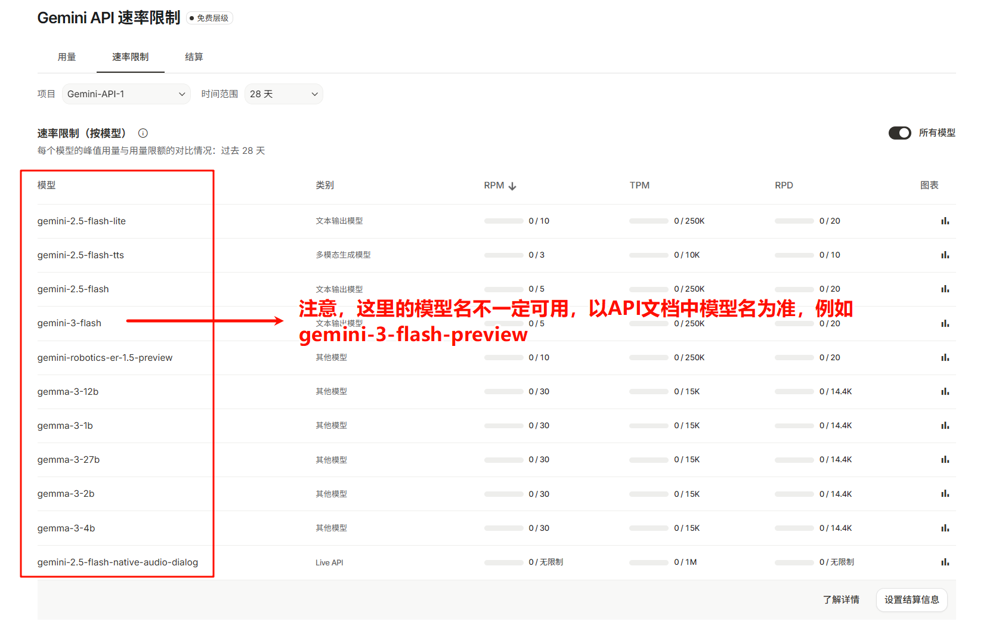
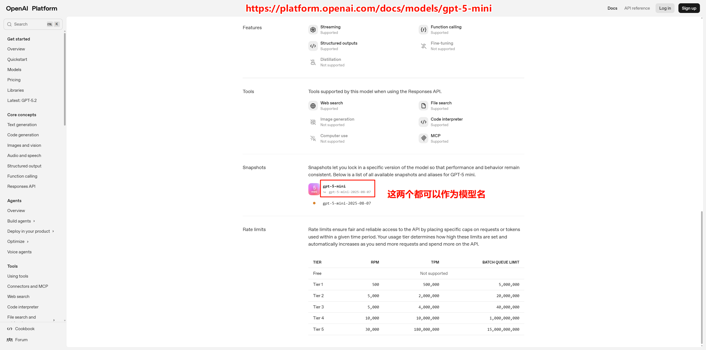

# API 配置指南

本指南详细介绍如何配置各大 AI 平台的 API，让 AI 管家为您工作。

## 支持的平台

AI 管家目前支持以下 6 种 API 接入方式：

| 平台                 | 接口类型                          | 适用场景                              |
| -------------------- | --------------------------------- | ------------------------------------- |
| **Google Gemini**    | 原生 Gemini API                   | 多模态能力强，支持直接读取 PDF        |
| **OpenAI**           | OpenAI 新接口(v1/responses)       | GPT 系列模型                          |
| **Anthropic Claude** | 原生 Claude API                   | Claude 系列模型                       |
| **OpenAI 兼容**      | OpenAI 兼容接口(chat/completions) | 第三方服务商（硅基流动、DeepSeek 等） |
| **OpenRouter**       | 统一 LLM 接口                     | 🌐 聚合数百种模型，一个 API 通用      |
| **火山方舟**         | 火山引擎 Chat Completions         | 🆕 豆包大模型，每日200万tokens免费    |

---

## Google Gemini 配置

### 获取 API 密钥

1. 访问 [Google AI Studio](https://aistudio.google.com/)
2. 使用 Google 账号登录
3. 点击左侧 **"Get API key"** → **"Create API key"**
4. 复制生成的 API 密钥
5. 确保配额层级不是 **"不可用"**，否则无法使用 API。若所有 API 配额都为 **"不可用"**，建议更换 Google 账号。

### 在插件中配置

1. 打开 **AI 管家仪表盘** → **快捷设置**
2. 平台选择 **Gemini**
3. 粘贴 API 密钥
4. 模型名称填写（例如：`gemini-2.5-flash`、`gemini-3-flash-preview` 等，确保模型名称正确，模型名称可从[Google Gemini API 文档](https://ai.google.dev/gemini-api/docs/models)获取）
5. 点击 **"测试连接"**

### 免费层级限制说明

Google AI Studio 免费层级对不同模型有不同的速率限制。查看可用的模型和限制：

1. 访问 [AI Studio 用量页面](https://aistudio.google.com/usage)
2. 点击 **"速率限制"**
3. 选择 **"所有模型"** 查看各模型的免费额度

> ⚠️ **注意**：上图截取于 2025 年 12 月 22 日，Google 可能随时调整免费层级支持的模型和配额，请以实际页面为准。

---

## OpenAI 配置

### 官方文档

- **API 文档**：[OpenAI API Reference](https://platform.openai.com/docs/api-reference)
- **模型列表**：[OpenAI Models](https://platform.openai.com/docs/models)
- **定价**：[OpenAI Pricing](https://openai.com/api/pricing/)

### 获取 API 密钥

1. 访问 [OpenAI Platform](https://platform.openai.com/)
2. 登录后进入 **Dashboard** → **API Keys**
3. 点击 **"Create new secret key"**
4. 复制生成的密钥（只显示一次，请妥善保存）

### 在插件中配置

1. 打开 **AI 管家仪表盘** → **快捷设置**
2. 平台选择 **OpenAI**
3. 粘贴 API 密钥
4. 模型名称填写（从 [官方模型列表](https://platform.openai.com/docs/models) 获取，模型名在Snapshots下，例如：`gpt-5.2`、`gpt-5-mini`）
5. 点击 **"测试连接"**

---

## Anthropic Claude 配置

### 官方文档

- **API 文档**：[Anthropic API Reference](https://docs.anthropic.com/en/api/getting-started)
- **模型列表**：[Anthropic Models](https://platform.claude.com/docs/en/about-claude/models/overview)
- **定价**：[Anthropic Pricing](https://www.anthropic.com/pricing)

### 获取 API 密钥

1. 访问 [Anthropic Console](https://console.anthropic.com/)
2. 注册并登录账号
3. 进入 **Settings** → **API Keys**
4. 点击 **"Create Key"** 创建密钥

### 在插件中配置

1. 打开 **AI 管家仪表盘** → **快捷设置**
2. 平台选择 **Anthropic**
3. 粘贴 API 密钥
4. 模型名称填写（从 [官方模型列表](https://platform.claude.com/docs/en/about-claude/models/overview) 获取，例如：`claude-opus-4-5`）
5. 点击 **"测试连接"**

---

## OpenAI 兼容接口（第三方平台）

许多第三方 AI 服务商提供兼容 OpenAI Chat Completions 格式的 API。配置时需要从各平台官方文档获取：

- **Base URL**：API 服务地址
- **模型名称**：平台支持的模型标识符

### 常见平台文档

| 平台         | API 文档                                                                                           | Base URL                                                |
| ------------ | -------------------------------------------------------------------------------------------------- | ------------------------------------------------------- |
| **硅基流动** | [SiliconFlow Docs](https://docs.siliconflow.cn/cn/api-reference/chat-completions/chat-completions) | `https://api.siliconflow.cn/v1/chat/completions`        |
| **DeepSeek** | [DeepSeek API](https://api-docs.deepseek.com/)                                                     | `https://api.deepseek.com/v1/chat/completions`          |
| **智谱 AI**  | [GLM API](https://open.bigmodel.cn/dev/api)                                                        | `https://open.bigmodel.cn/api/paas/v4/chat/completions` |
| **Moonshot** | [Kimi API](https://platform.moonshot.cn/docs/api/chat)                                             | `https://api.moonshot.cn/v1/chat/completions`           |

### 配置方法

1. 打开 **AI 管家仪表盘** → **快捷设置**
2. 平台选择 **OpenAI 兼容**
3. 填写以下信息：
   - **API 密钥**：从第三方平台控制台获取
   - **API 地址**：填写上表Base URL或参考平台官方文档
   - **模型名称**：从平台官方文档获取（注意大小写和格式）

### 硅基流动配置示例

1. 访问 [硅基流动官网](https://siliconflow.cn/) 注册账号
2. 在控制台 → API Keys 获取密钥
3. 在 [模型列表](https://docs.siliconflow.cn/cn/docs/model-names) 选择模型
4. 在插件中配置：
   - **Base URL**：`https://api.siliconflow.cn/v1`
   - **模型名称**：例如 `Qwen/Qwen2.5-72B-Instruct`

### DeepSeek 配置示例

1. 访问 [DeepSeek 开放平台](https://platform.deepseek.com/) 注册账号
2. 获取 API 密钥
3. 参考 [模型文档](https://api-docs.deepseek.com/zh-cn/) 选择模型
4. 在插件中配置：
   - **Base URL**：`https://api.deepseek.com/v1`
   - **模型名称**：例如 `deepseek-chat`

---

## OpenRouter 配置

OpenRouter 提供统一的 LLM API 接口，聚合了数百种 AI 模型，让您能够通过一个 API 密钥访问来自 OpenAI、Anthropic、Google、Meta 等多家厂商的模型。

### 官方文档

- **官网**：[OpenRouter](https://openrouter.ai/)
- **API 文档**：[OpenRouter Docs](https://openrouter.ai/docs)
- **模型列表**：[OpenRouter Models](https://openrouter.ai/models)
- **价格**：[OpenRouter Pricing](https://openrouter.ai/pricing)

### 获取 API 密钥

1. 访问 [OpenRouter](https://openrouter.ai/)
2. 注册账号（支持 Google 登录）
3. 进入 **Dashboard** → **Keys**
4. 创建新的 API Key

### 推荐理由

- 🌐 **模型丰富**：一个 API 访问 GPT-5、Claude、Gemini、Llama 等数百种模型
- 💰 **灵活定价**：按需付费，不同模型价格透明
- 🔄 **高可用性**：自动故障转移，保证服务稳定

### 在插件中配置

1. 打开 **AI 管家仪表盘** → **快捷设置**
2. 平台选择 **OpenRouter**
3. 填写以下信息：
   - **API 地址**：`https://openrouter.ai/api/v1/chat/completions`
   - **API 密钥**：从 OpenRouter Dashboard 获取
   - **模型名称**：例如 `google/gemini-3-pro-preview`、`openai/gpt-5.2`
4. 点击 **"测试连接"**

> 💡 **提示**：在 [模型列表](https://openrouter.ai/models) 页面可查看所有可用模型及其价格。

---

## 火山方舟（豆包大模型）配置

火山引擎旗下的大模型服务平台，提供豆包 (Doubao) 系列大模型，支持多模态理解。

### 官方文档

- **API 文档**：[火山方舟 API Reference](https://www.volcengine.com/docs/82379/1399009)
- **模型列表**：[豆包大模型](https://www.volcengine.com/docs/82379/1330310)
- **控制台**：[火山方舟控制台](https://console.volcengine.com/ark)

### 获取 API 密钥

1. 访问 [火山引擎控制台](https://console.volcengine.com/)
2. 注册并完成实名认证
3. 进入 **火山方舟** → **API Key 管理**
4. 创建 API Key

### 推荐模型

| 模型名称                 | 特点                  |
| ------------------------ | --------------------- |
| `doubao-seed-1-8-251228` | 🌟 推荐，多模态能力强 |
| `doubao-seed-1-6-250615` | 性价比高              |

### 免费额度

🎁 **每日 200 万 tokens 免费**，足够个人日常使用。

### 在插件中配置

1. 打开 **AI 管家仪表盘** → **快捷设置**
2. 平台选择 **火山方舟 (Volcano Ark)**
3. 填写以下信息：
   - **API 地址**：`https://ark.cn-beijing.volces.com/api/v3/chat/completions`
   - **API 密钥**：从火山方舟控制台获取
   - **模型名称**：例如 `doubao-seed-1-8-251228`
4. 点击 **"测试连接"**

---

## PDF 处理模式

AI 管家提供两种 PDF 处理方式：

| 模式                | 说明                    | 适用场景                              |
| ------------------- | ----------------------- | ------------------------------------- |
| **多模态 (Base64)** | 将 PDF 编码后发送给模型 | 支持多模态的模型（如 Gemini、GPT-4o） |
| **文本提取**        | 提取 PDF 文字内容发送   | 不支持多模态的模型                    |

### 切换方法

1. 打开 **AI 管家仪表盘** → **快捷设置**
2. 找到 **"PDF 处理模式"**
3. 根据您使用的模型选择合适的模式

> 💡 **提示**：如果遇到 "The model is not a VLM" 等报错，请切换为 **文本提取** 模式。

---

## gcli2api 免费方案（进阶）

如果您希望免费使用 Gemini 模型但遇到 API 限制，可以参考 [gcli2api](https://github.com/su-kaka/gcli2api) 方案。

详细部署教程请参阅：[Discussion #54 - gcli2api 配置教程](https://github.com/steven-jianhao-li/zotero-AI-Butler/discussions/54#discussioncomment-15199692)

---

## 下一步

- 遇到配置问题？查看：[常见问题 FAQ](faq.md)
- 遇到报错？查看：[故障排除](troubleshooting.md)
