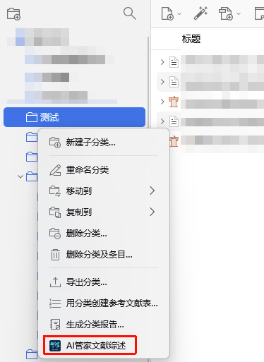

# 📚 文献综述生成

AI管家支持对多篇论文进行综合分析，自动生成文献综述报告。

## 功能介绍

**文献综述生成**功能可以让您：

- 选择分类下的多篇论文
- 支持从论文条目的可分析内容源中提取内容：
  - 文献 PDF 内容
  - 网页快照
- 调用大模型生成综合文献综述
- 在分类下创建独立的综述笔记

## 使用方法

### 步骤 1：打开文献综述配置

在 Zotero 中，右键点击任意**分类（Collection）**，选择 **"AI管家文献综述"**。

### 步骤 2：配置综述参数

在弹出的配置页面中：

1. **综述名称**：为您的综述报告命名（默认为当前日期）
2. **自定义提示词**：可以修改默认提示词以满足特定需求
3. **选择论文**：勾选需要纳入综述的论文
   - 论文列表显示分类下所有有可分析附件的文献
   - 如果论文有多个 PDF，可展开查看并单独选择；网页快照会作为文本内容源显示

### 步骤 3：生成综述

点击 **"🚀 生成综述"** 按钮，AI管家将：

1. 对选中的内容源逐篇填表
2. 汇总结构化表格内容
3. 调用大模型生成综合文献综述
4. 在当前分类下保存独立综述笔记
5. 为已纳入综述的文献添加 `AI-Reviewed` 标签

## 生成的内容

成功生成后，您的分类下会新增一条独立的 **AI 综述笔记**，包含：

- **综合文献综述**：基于所选论文表格信息生成的综述内容
- **引用链接**：正文中的文献引用会尽量链接回对应 Zotero 条目
- **处理标签**：已纳入综述的文献会标记为 `AI-Reviewed`

## 默认提示词

默认的文献综述提示词会指导 AI 生成以下内容：

1. **研究主题概述**：论文共同关注的研究领域和核心问题
2. **各论文主要贡献**：逐一总结每篇论文的核心观点、方法和发现
3. **研究方法对比**：分析各论文研究方法的异同
4. **主要发现汇总**：综合各论文的主要结论和发现
5. **研究趋势与展望**：分析该领域的发展趋势和未来研究方向

## 技术说明

- **多来源支持**：PDF 可使用 Gemini API 的 `inline_data` 方式发送；网页快照会作为文本内容源发送
- **大文件处理**：使用分块 Base64 编码，支持大型 PDF 文件
- **笔记保存**：综述结果会作为独立笔记保存到当前分类下

## 注意事项

1. **API 额度**：综述生成会发送多篇文献内容，请注意 API 额度消耗
2. **文件大小**：PDF 多文件上传受 API 限制，建议单次不超过 10 篇论文；文本来源会自动清理并截断
3. **支持模型**：PDF 多文件上传依赖模型能力；文本来源可在文本模型中使用
