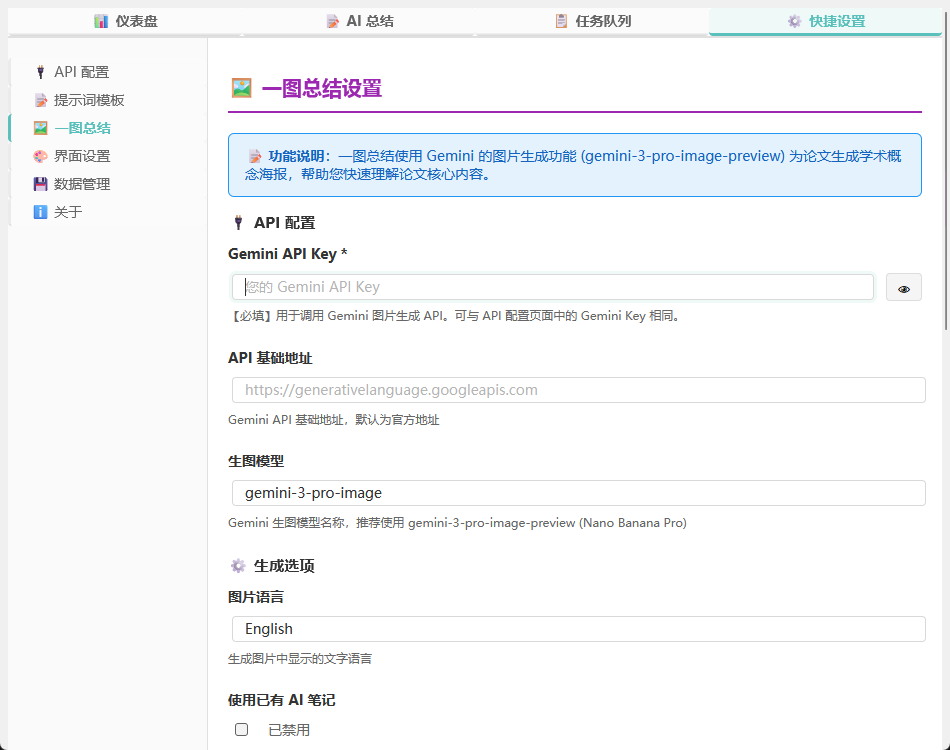
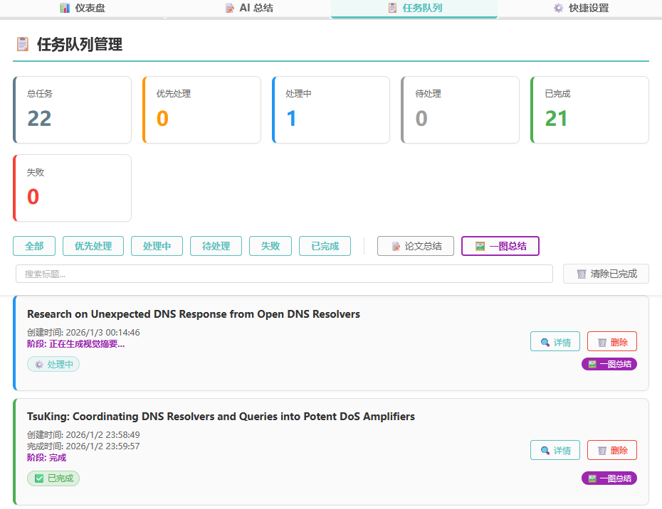
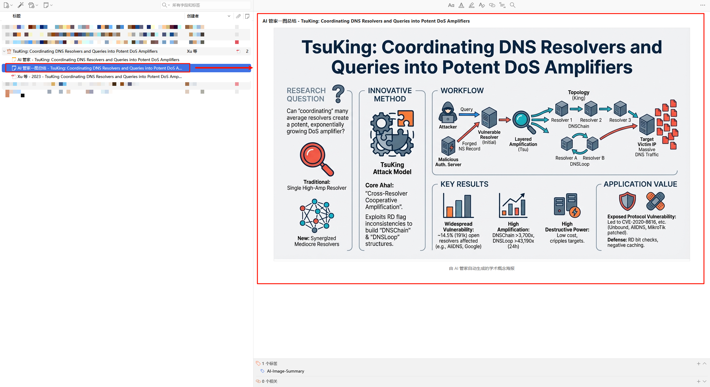

# 🖼️ 一图总结功能 (实验性)

> **一图胜千言** —— 让 AI 为您的论文生成一张精美的学术概念海报！

## 功能介绍

一图总结是 AI 管家的实验性功能，利用 Gemini 的图片生成能力，将论文的核心内容可视化为一张学术概念海报。

### 工作流程

1. **提取论文内容**：读取 PDF 文件内容
2. **生成视觉摘要**：调用 LLM 提取关键视觉信息
3. **生成学术海报**：调用 Gemini 生图模型生成图片
4. **保存到笔记**：将图片保存为 Zotero 笔记

## 如何使用

### 1. 配置 API

1. 打开 AI 管家仪表盘 → **设置** → **🖼️ 一图总结**
2. 填写 **Gemini API Key**（支持与论文总结使用相同的 Key）
3. 确认 **API 基础地址**（默认为 `https://generativelanguage.googleapis.com`）
4. 选择 **生图模型**（推荐 `gemini-3-pro-image-preview`）
5. 点击 **测试 API** 验证配置

### 2. 生成一图总结

1. 在 Zotero 中选中一篇有 PDF 附件的文献
2. 右键 → 选择 **"召唤AI管家一图总结"**
3. 在任务队列中查看生成进度
4. 生成完成后，图片会保存为该条目下的笔记

### 3. 查看任务进度

1. 打开 AI 管家仪表盘 → **任务队列**
2. 点击 **"🖼️ 一图总结"** 筛选按钮
3. 查看任务的进度条和当前阶段

## 提示词配置

一图总结使用两阶段提示词：

### 视觉信息提取提示词

第一阶段从论文中提取用于生成图片的关键信息，包括：

- 研究问题
- 创新方法
- 工作流程
- 关键结果
- 应用价值

### 生图提示词

第二阶段根据视觉摘要生成学术概念海报。提示词中定义了：

- 艺术风格：现代极简科技信息图
- 构图要求：居中构图或从左到右的流程
- 配色方案：深学术蓝、板岩灰、活力橙
- 文字渲染：使用衬线字体，支持中英文

### 自定义提示词

您可以在 **设置 → 一图总结 → 提示词配置** 中自定义提示词：

**可用变量**：

- `${context}` - 论文内容
- `${title}` - 论文标题
- `${language}` - 语言设置
- `${summaryForImage}` - 视觉摘要结果

## 使用技巧

### 🎨 提示词优化建议

- **更具体的隐喻**：在提示词中添加具体的视觉隐喻，如"用一座桥梁表示连接"
- **颜色偏好**：指定您喜欢的配色方案
- **布局要求**：明确图片的布局，如"从左到右的流程图"

### ⚠️ 注意事项

- 生图过程可能需要 30-60 秒，请耐心等待
- 并非所有 API 端点都支持图片生成，请确保使用支持生图的模型
- 图片质量取决于提示词和模型能力

## 分享您的成果

我们鼓励用户分享自己优化的提示词和生成结果！

- 🌟 优秀的提示词有机会被选为默认模板
- 💬 请在 [Discussion](https://github.com/steven-jianhao-li/zotero-AI-Butler/discussions) 中分享

