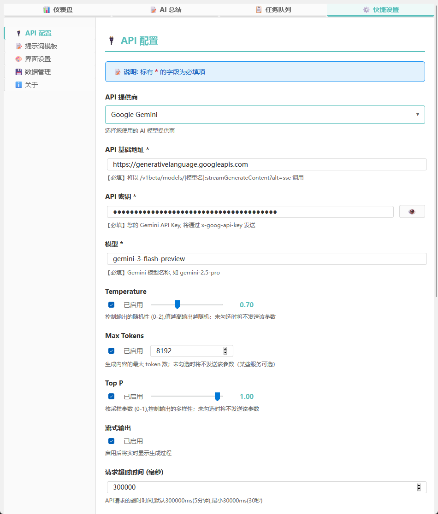
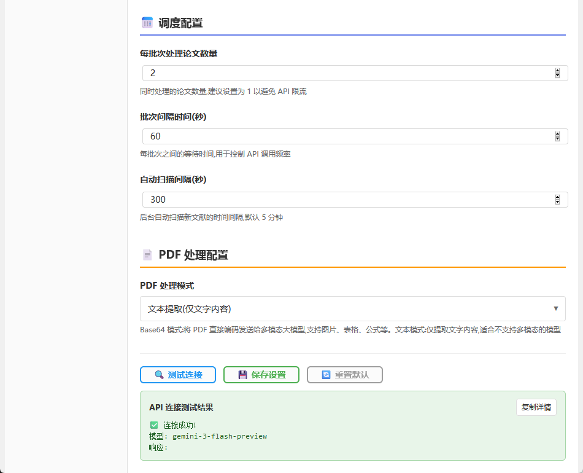
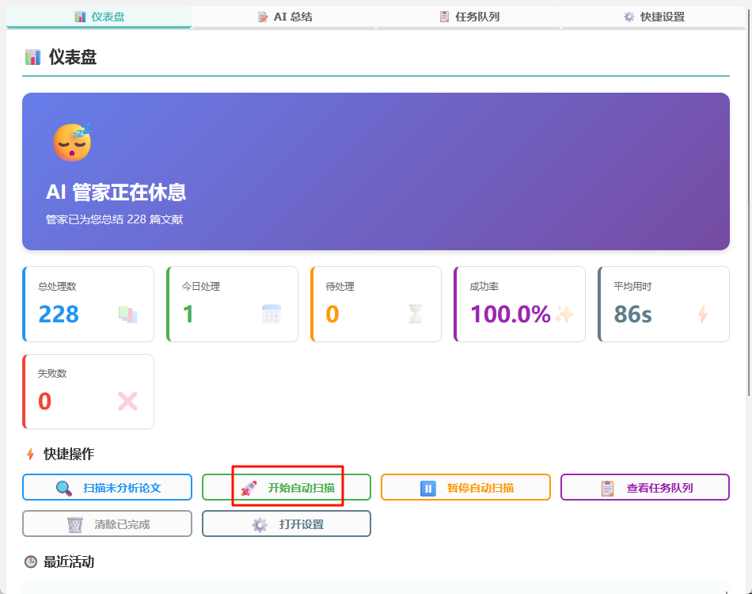
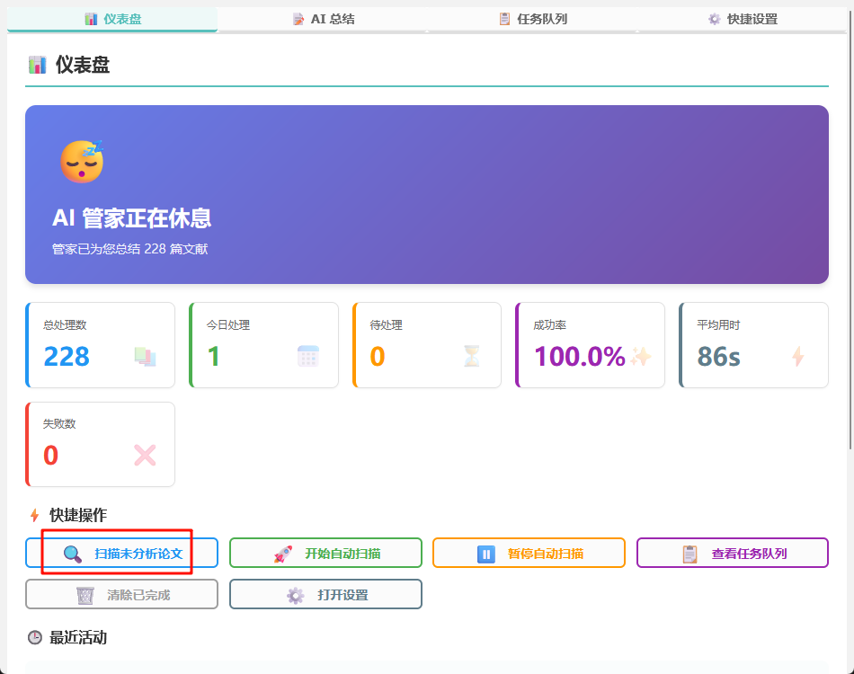
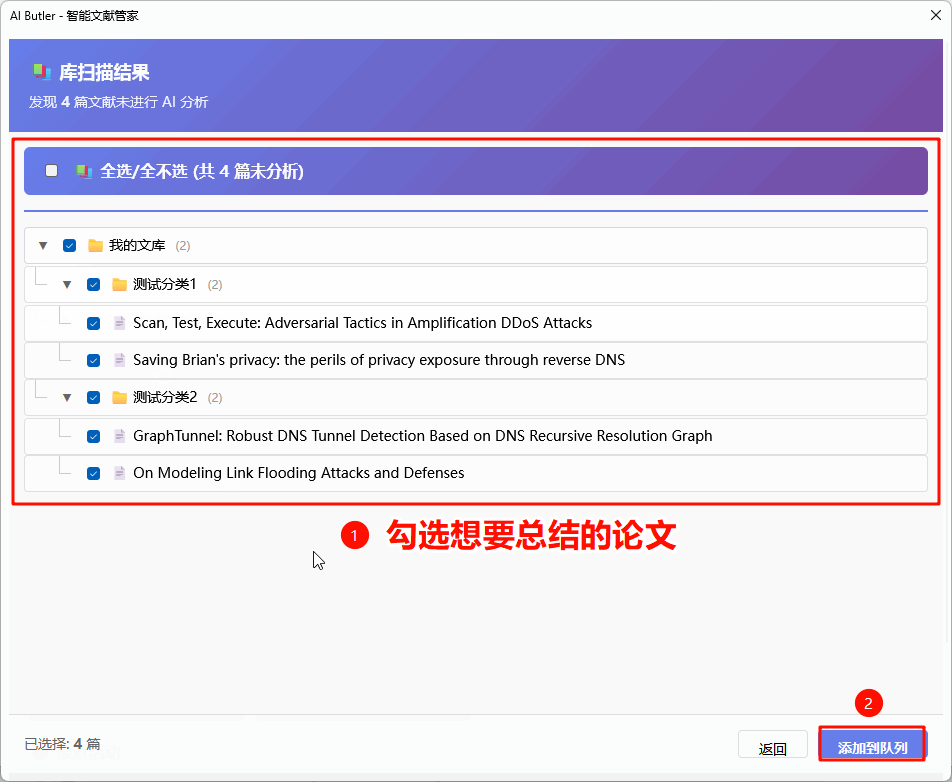

# 快速开始

本指南将帮助您在 5 分钟内完成 Zotero AI Butler 的安装与配置。

## 1. 安装插件

1. 访问 [GitHub Releases 页面](https://github.com/steven-jianhao-li/zotero-AI-Butler/releases)
2. 下载最新版本的 `.xpi` 文件
3. 打开 Zotero，点击菜单 **"工具"** → **"插件"**
4. 将下载的 `.xpi` 文件拖拽到插件窗口中，完成安装

## 2. 配置 API

> 本项目为开源平台，**不提供**大模型 API 密钥，需自行根据需求选择大模型平台并获取 API 密钥。

1. 在任意论文条目上右键 → **"AI 管家仪表盘"**
2. 进入 **"快捷设置"** 选项卡
3. 选择您的 AI 平台（例如 Google Gemini）
4. 填入 API 密钥，点击 **"测试连接"** 确认可用

> 💡 **提示**：详细的 API 配置方法请参阅 [API 配置指南](api-configuration.md)

Google Gemini 官方 API 配置示例：

5. 使用 **"🔍 测试连接"** 按钮测试连接是否成功。

Google Gemini 官方 API 测试连接成功示例：

> ⚠ 若使用第三方中转平台，测试连接成功并不代表大模型 API 可用，需以实际功能为准。

## 3. 开始使用

配置完成后，有两种主要使用方式：

### 方式一：自动扫描新论文

开启此功能后，当您向 Zotero 添加新论文时，AI 管家会自动将其加入总结队列。

**开启步骤**：
1. 打开 **"AI 管家仪表盘"**
2. 点击 **"🚀 开始自动扫描"**
3. 设置保存后即刻生效

开启后，拖入新 PDF 论文时将自动进入任务队列：

### 方式二：扫描未分析论文（批量总结库中已有文献）

对于已存在于 Zotero 中的旧论文，可以使用批量扫描功能补充笔记。

**使用步骤**：
1. 打开 **"AI 管家仪表盘"**
2. 点击 **"🔍 扫描未分析论文"**
3. AI 管家会按目录结构列出所有未生成笔记的论文
4. 勾选需要分析的论文（可按目录全选）
5. 点击 **"添加到队列"**

## 下一步

- 了解更多 API 配置选项：[API 配置指南](api-configuration.md)
- 遇到问题？查看：[常见问题 FAQ](faq.md)
